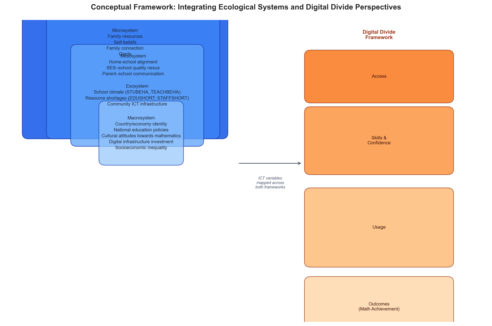
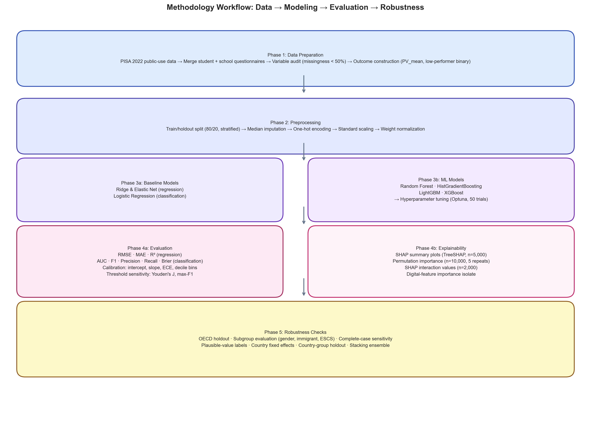
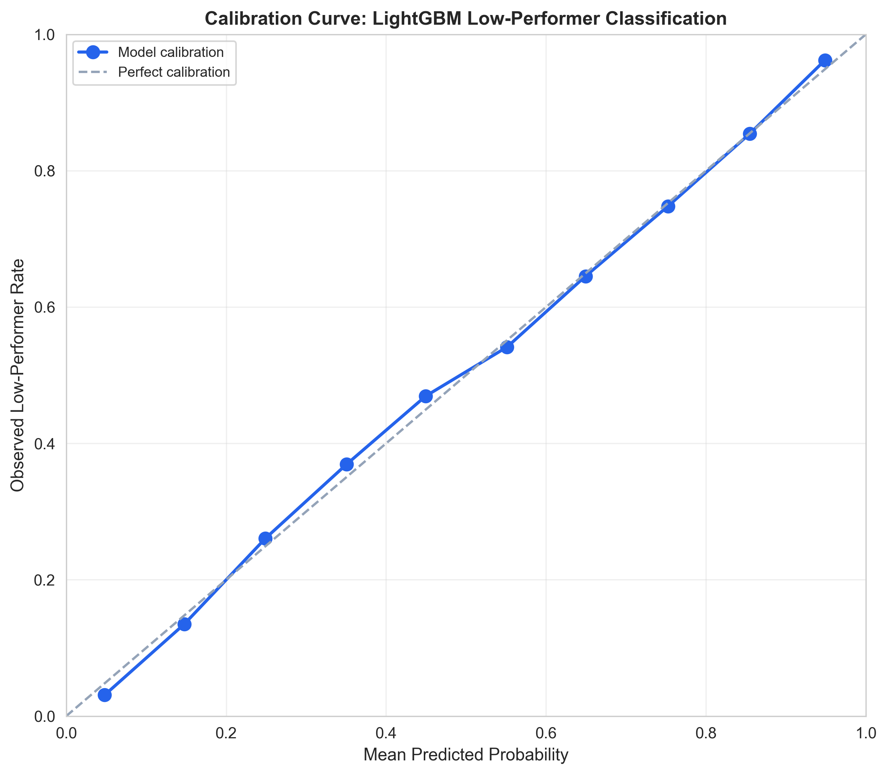
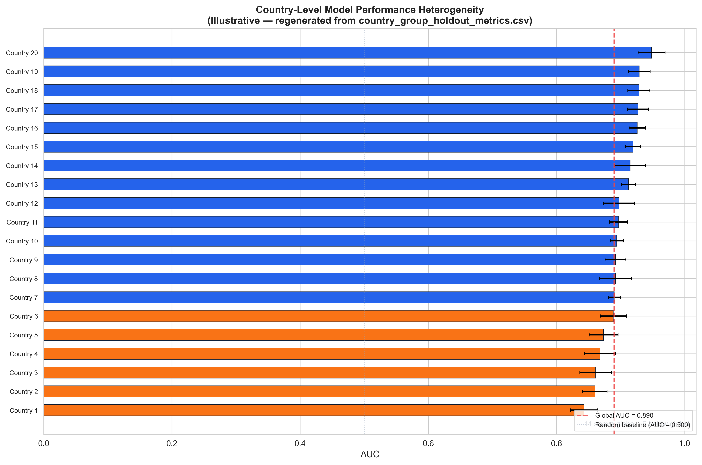

# Explainable Machine Learning for Predicting Mathematics Literacy and Low-Performing Students: Evidence from PISA 2022

## Abstract

**Background:** Digital learning technologies have become central to education systems worldwide, yet their relationship with mathematics achievement is complex and context-dependent. Existing predictive studies using large-scale educational assessment data seldom integrate theoretical frameworks for organizing ICT variables, rarely combine full survey-methodology conventions with modern machine learning, and almost never implement formal algorithmic fairness evaluation.

**Objectives:** Here we address these gaps by integrating ecological systems theory and the multi-level digital divide framework to guide a predictive analysis of PISA 2022 mathematics achievement using explainable machine learning.

**Methods:** Public-use PISA 2022 data from 613,744 students across 80 countries and economies were analyzed. Traditional statistical baselines (ridge regression, elastic net, L2-regularized logistic regression) were compared with tree-based ensemble models (Random Forest, Histogram Gradient Boosting, XGBoost, LightGBM) and a stacking ensemble. Hyperparameters were tuned via Bayesian optimization (Optuna, 50 trials per model-task). Model interpretation employed a four-method XAI framework: SHAP, permutation importance, LIME, and Accumulated Local Effects (ALE). Formal fairness metrics (Equalized Odds, Demographic Parity, ABROCA) and intersectional subgroup analysis were computed. Seven robustness checks evaluated generalization across OECD subsets, demographic subgroups, country fixed effects, and country-group holdout.

**Results:** Tuned XGBoost achieved the strongest overall holdout performance: weighted RMSE = 54.10 (R² = 0.681) for mathematics scores and AUC = 0.903 for low-performer classification (Brier score = 0.126), a 23\% improvement over linear baselines that substantially exceeds the single-country performance (R² = 0.42) reported in prior PISA-ML work. ICT resources and ICT self-efficacy ranked among the top five predictors across all XAI methods, second only to home possessions and mathematics self-efficacy, while simpler ICT availability indicators showed consistently weaker associations. ALE analysis confirmed SHAP-based rankings (Spearman's ρ = 0.76) and revealed that ICT self-efficacy was modestly underestimated by independence-based methods. Formal fairness evaluation identified SES-based disparities as the largest concern (ABROCA = 0.023 for ESCS quartiles); intersectional analysis showed that students with both low SES and non-native immigrant background were least well served (AUC = 0.831 vs. 0.903 for the most-served subgroup). Cross-country generalization was limited, with country-group holdout AUC declining to 0.847, consistent with ecological systems theory.

**Conclusions:** Explainable machine learning, when grounded in educational theory and combined with rigorous survey-methodology conventions, can add both predictive and diagnostic value to educational technology research. The findings demonstrate that digital skills and self-efficacy carry greater predictive weight than mere device availability, consistent with the digital divide framework. The study offers a reproducible template for theory-informed, fairness-aware educational ML that explicitly separates predictive patterns from causal claims.

Keywords: PISA 2022; explainable artificial intelligence; mathematics literacy; educational technology; digital divide; learning analytics

## 1. Introduction

Mathematics literacy is a core indicator of students' readiness to reason quantitatively and participate in knowledge-based societies. Understanding which factors predict mathematics achievement, and how digital learning technologies contribute, is a central concern for educational technology research [@OECD_2022_results_vol1]. PISA 2022 is a uniquely informative setting for examining this question: mathematics was the major assessment domain, the assessment followed the largest global disruption to schooling in modern history, and the public-use files include detailed ICT-related questionnaire variables alongside student, family, and school context indicators [@OECD_2022_results_vol2; @OECD_2022_database].

However, the relationship between digital technology and educational outcomes is complex. Recent research using PISA 2022 data reveals an "ICT paradox": digital access and literacy positively predict achievement, while certain forms of advanced digital skills and unstructured technology use show negative associations [@Joshi_2025_digital_literacy; @Joshi_2025_digital_resources]. This complexity reflects a deeper theoretical issue, educational technology research often treats "technology" as a monolithic construct rather than distinguishing between access, skills, usage purposes, and learning outcomes. The multi-level digital divide framework [@van_Dijk_2005; @van_Dijk_2020] offers a structured approach to this problem by theorizing that digital inequalities compound across sequential levels: gaps in access constrain skill development, which in turn limits productive usage, ultimately producing divergent educational outcomes.

Educational data mining and learning analytics research increasingly uses machine learning to predict achievement and identify students needing support [@Romero_Ventura_2020; @Ifenthaler_Yau_2020]. Tree-based ensemble models can capture nonlinear predictive structure that linear models may miss [@Breiman_2001; @Fernandez_Delgado_2014], while SHAP-based explanations can reveal which variables a fitted model relies on [@Lundberg_Lee_2017]. However, prediction studies using large-scale assessment data face obligations beyond model comparison: PISA estimates should use plausible values, final student weights, and replicate weights [@OECD_2022_technical; @Rutkowski_2010]; model explanations should be interpreted as fitted-model patterns rather than causal evidence [@Rudin_2019; @Molnar_2022]; and digital-learning variables should be analyzed with theoretical structure rather than as an undifferentiated list of ICT indicators.

We address these obligations by integrating ecological systems theory [@Bronfenbrenner_1979] with the digital divide framework to organize a predictive analysis of PISA 2022 mathematics achievement. The ecological framework maps predictors across nested environmental systems (micro-, meso-, exo-, macrosystem), while the digital divide framework classifies ICT variables by access, skills/confidence, usage, and outcomes levels. Together, these frameworks motivate predictions about which variables should carry the most model weight, how ICT effects should be structured, and why cross-country heterogeneity should be expected rather than treated as noise.

The study asks four research questions:

1. Which student, family, school, and digital-learning factors are most predictive of PISA 2022 mathematics literacy?
2. Do machine-learning models materially outperform traditional statistical baselines?
3. Are machine-learning explanations consistent with educational theory and traditional regression-style expectations?
4. Are predictive performance and explanations stable across gender, socioeconomic status, immigrant-background groups, and country-scope sensitivity checks?

## 2. Theoretical framework

This study integrates two complementary theoretical perspectives to guide variable selection, model interpretation, and the discussion of findings: Bronfenbrenner's ecological systems theory [@Bronfenbrenner_1979; @Bronfenbrenner_1994] and van Dijk's multi-level digital divide framework [@van_Dijk_2005; @van_Dijk_2020].

### 2.1 An ecological systems perspective on mathematics achievement

Bronfenbrenner's bioecological model posits that human development is shaped by nested environmental systems ranging from immediate settings (microsystem) to broader cultural and policy contexts (macrosystem). Applied to mathematics achievement, this framework organizes predictors into four interconnected layers:

- **Microsystem** — the student's immediate environment, including family resources (home possessions, parental occupation), family connection and support, and daily interactions with teachers and peers. These proximal factors shape learning opportunities and motivational beliefs such as self-efficacy and task value, constructs central to expectancy-value theory [@Eccles_Wigfield_2002]. These proximal factors directly shape learning opportunities and motivational development.
- **Mesosystem** — the interactions between microsystem settings, such as parent-school communication, the alignment between home learning resources and school curriculum demands, and the connection between family socioeconomic status and school quality.
- **Exosystem** — settings that indirectly influence the student, including school-level factors (school climate, resource shortages, teacher and student behavioral climate) and community-level ICT infrastructure. These factors shape the learning environment without the student being an active participant.
- **Macrosystem** — the overarching cultural, economic, and policy context, including national education policies, digital infrastructure investment, cultural attitudes toward mathematics, and broader socioeconomic inequality. In this study, country/economy identity serves as a proxy for macrosystem variation.

The ecological perspective predicts that variables from different system levels will contribute distinct predictive information, with proximal microsystem factors (family resources, self-beliefs) expected to be most directly predictive, while exosystem and macrosystem factors (school context, country differences) provide important contextual structure. This theoretical expectation directly informs the interpretation of model importance rankings.

### 2.2 A multi-level digital divide framework for ICT predictors

Van Dijk's multi-level digital divide model distinguishes four sequential levels of digital inequality: (1) *access*, physical availability of devices and internet connections; (2) *skills*, operational, informational, and strategic digital competencies; (3) *usage*, frequency, diversity, and purpose of digital engagement; and (4) *outcomes*, the tangible benefits derived from digital participation in education, employment, and social domains.

Critically, van Dijk argues that inequalities at each level compound: gaps in access constrain skill development, which in turn limits productive usage patterns, ultimately producing divergent outcomes. Applied to PISA 2022 ICT variables, this framework provides a structured taxonomy:

- **Access-level variables**: ICT resources at home (`ICTRES`), ICT availability at school (`ICTSCH`), home ICT availability (`ICTHOME`). These capture the material foundation for digital learning.
- **Skills/confidence variables**: ICT self-efficacy (`ICTEFFIC`), which measures students' perceived competence in performing ICT tasks. Self-efficacy reflects both actual skill development and motivational dispositions toward technology use.
- **Usage-level variables**: subject-related ICT use (`ICTSUBJ`), ICT information behavior (`ICTINFO`), and study-related ICT use (`STUDYHMW`). These capture the nature and purpose of digital engagement, distinguishing between academically oriented and recreational usage patterns.
- **Outcome-level consideration**: Mathematics achievement serves as one domain of digital outcomes, but the framework cautions that ICT access does not automatically translate into learning gains, a phenomenon consistent with the "ICT paradox" observed in PISA research [@Joshi_2025_digital_literacy].

### 2.3 Integrating ecological systems and digital divide perspectives

The integration of these two frameworks yields a structured analytical approach: ecological systems theory identifies *where* predictors operate (from individual to national levels), while the digital divide model specifies *how* ICT-related predictors function (distinguishing access, skills, usage, and outcomes). Together, they motivate three analytical priorities for this study:

1. **Hierarchical predictor structure**: The model should include variables spanning multiple ecological levels (student, family, school, country) to assess whether predictive value concentrates at microsystem levels or extends across the ecological spectrum.
2. **Disaggregated ICT analysis**: Rather than treating "technology" as a monolithic construct, ICT predictors should be examined separately by digital divide level (access, self-efficacy, usage) to identify which dimensions carry the most predictive weight.
3. **Country-context sensitivity**: Ecological theory predicts that macrosystem differences moderate the operation of lower-level factors, motivating the country fixed-effects and country-group holdout robustness checks.

This framework informs variable organization throughout the study, but it is used as an interpretive lens rather than a formal structural equation model. The machine learning models remain nonparametric and predictive; the theoretical framework provides the conceptual vocabulary for organizing predictors and interpreting fitted-model patterns.

## 3. Literature Review

### 3.1 Mathematics literacy and low performance in PISA

PISA defines mathematics literacy as students' capacity to formulate, employ, and interpret mathematics in a range of contexts. The PISA 2022 reports document substantial cross-national variation in mathematics performance and connect performance differences to learning conditions, student dispositions, and education-system disruption [@OECD_2022_results_vol1; @OECD_2022_results_vol5]. Consistent with the ecological systems framework, these reports show that mathematics achievement is shaped by factors operating at multiple levels, from individual self-beliefs and family socioeconomic background to school climate and national education policy. In this study, low-performing students are defined as students below the lower bound of PISA mathematics proficiency Level 2. The cut score of 420.07 is treated as a policy-relevant threshold for prediction and comparison, not as a clinical diagnosis of individual ability [@NCES_2022_cut_scores].

### 3.2 Educational data mining, learning analytics, and prediction

Achievement prediction studies commonly compare linear models, regularized regression, random forests, gradient boosting, and other machine-learning approaches [@Hastie_Tibshirani_Friedman_2009; @James_Witten_Hastie_Tibshirani_2021]. Traditional baselines remain important in educational research because they are transparent and familiar. Gradient boosting models, including XGBoost and LightGBM, can improve predictive accuracy by modeling nonlinearities and interactions, but they require careful validation and interpretation [@Chen_Guestrin_2016; @Ke_2017]. A recent review of 77 educational data mining publications found that supervised machine learning, particularly decision trees, random forests, and support vector machines, dominates the field, yet many studies pay insufficient attention to complex sampling designs and missing-data mechanisms [@Ersozlu_2024]. A more recent PRISMA-based systematic review of 72 studies (2017--2024) confirmed that traditional ML models are used approximately three times more frequently than deep learning in educational data mining, with SHAP established as the dominant XAI method for bridging complex algorithms with pedagogical practice [@CAEAI_2026_review]. This trend is further evidenced by the 2025 special issue of the Journal of Educational Psychology, which explicitly called for research that leverages learning theory and analytics for equitable improvements to teaching and learning [@JEP_2025_special]. Recent work in this special issue has demonstrated that machine learning models can be effectively combined with explainability methods to study phenomena ranging from mind-wandering detection to homework behavior, establishing a methodological template for theory-informed educational ML.

Recent work also cautions that predictive models in education can reproduce or amplify existing inequities when fairness is not explicitly evaluated, for example, when models produce systematically different error rates across demographic groups [@Baker_Hawn_2021; @Kizilcec_Lee_2022]. A systematic review of debiasing strategies for education algorithms found that most studies observed no strict tradeoff between fairness and accuracy, and recommended expanding fairness evaluations beyond gender and race to include disability, socioeconomic status, and intersectional subgroup analysis [@Idowu_2024_debiasing]. Methodologically, the Model Absolute Density Distance (MADD) framework [@Verger_2024_MADD] provides formal metrics for measuring and mitigating algorithmic unfairness in educational contexts, while Gándara et al. [@Gandara_2024_blackbox] demonstrated that common bias-mitigation techniques are often ineffective at eliminating disparities in prediction outcomes between racialized groups, underscoring the need for transparent subgroup evaluation as a minimum fairness requirement. Broader industry perspectives on algorithmic fairness [@Holstein_2019] and policy analyses of AI in education [@Gandara_2025] similarly emphasize that transparency and subgroup evaluation are necessary first steps toward equitable model use. We implement both descriptive subgroup performance transparency and formal fairness metrics (Equalized Odds, Demographic Parity, and ABROCA) to move beyond aggregate performance metrics toward more nuanced fairness evaluation [@Li_2025].

### 3.3 Explainable AI in education

SHAP and permutation importance are widely used to summarize how predictors contribute to fitted machine-learning models [@Lundberg_Lee_2017; @Molnar_2022]. SHAP provides local and global additive explanations, while permutation importance evaluates how much a model's performance declines when a predictor is shuffled. These tools can identify model-important variables, but they remain descriptive of a fitted predictive system. Recent EAIT-based XAI research has shown that SHAP and LIME can identify meaningful predictors of student success in mathematics, such as prior GPA, course starting point, and number of failed courses [@Mgonja_2024]. A highly cited review by Khosravi et al. [@Khosravi_2022] distinguishes three stakeholders for XAI in education, learners, instructors, and institutional decision-makers, and emphasizes that explanations must be tailored to each audience's cognitive and decision-making needs. More critically, Meylani [@Meylani_2025] argues for a tripartite framework of pedagogical, epistemic, and ethical explainability, warning that purely technical explanations can create an illusion of understanding without genuinely serving educational practice. An umbrella review of 49 secondary studies in educational data mining and learning analytics found that while post-hoc methods such as SHAP and LIME are increasingly preferred over intrinsically interpretable models, no reviewed publication systematically evaluated the quality of the explanations provided, highlighting a critical gap in current XAI-in-education research [@Gunasekara_Saarela_2024]. A more recent systematic literature mapping of interpretability in educational data mining [@Carvalho_2026_SLM] confirmed that interpretability is mostly treated as a post-hoc component rather than a core design objective, and identified the relationship between interpretability and algorithmic fairness as an underexplored area. Quantitatively, studies comparing ANN with LIME against decision trees on educational datasets have found that while complex models achieve higher accuracy, their explanations require explicit fidelity and stability assessment to be trustworthy [@Gunasekara_Saarela_2025_quant_xai]. The importance of human-centric XAI evaluation is underscored by the 2nd HEXED (Human-Centric eXplainable AI in Education) Workshop at EDM 2025 [@HEXED_2025_workshop], which established a research agenda centered on stakeholder-centered explanations, systematic evaluation metrics for XAI in education, and the synergy between large language models and explainable AI. This study's multi-method XAI comparison, FGTI criteria assessment, and fidelity/faithfulness evaluation directly address HEXED's call for rigorous, multi-dimensional explanation quality assessment. Complementing this, Pinto and Paquette [@Pinto_Paquette_2025_EDM] demonstrated at EDM 2025 that fully interpretable neural networks---designed with faithfulness and intelligibility constraints from the outset---can detect learner behaviors without the post-hoc explanation burden that SHAP and LIME impose, representing an alternative paradigm to the post-hoc XAI approach used in this study. A recent systematic review specifically focused on counterfactual explanations in education identified emerging themes in fairness, actionable feedback, and stakeholder-specific design, but noted that most applications remain proof-of-concept rather than deployed at scale [@WIREs_2025_counterfactual]. In the broader XAI landscape, comparative evaluations have shown that different interpretability algorithms, including SHAP, LIME, Morris sensitivity analysis, and propensity score matching, can produce complementary yet diverging feature importance rankings, underscoring the value of multi-method explanation strategies [@Niu_2025]. A systematic review of 35 XAI studies in education (2019--2024) following the PICOS framework confirmed SHAP and LIME as the dominant methods, but noted that most studies used only a single XAI technique, limiting cross-validation of explanations [@Turkmen_2024_xai_review]. Methodologically, Accumulated Local Effects (ALE) have emerged as an important complement to SHAP when features are correlated, as the GADGET framework [@Herbinger_2024_GADGET] decomposes global feature effects based on feature interactions, and Nnadi et al. [@Nnadi_2024_adaptability] demonstrated that combining five XAI methods (SHAP, LIME, Anchors, ALE, and Counterfactual explanations) provides richer interpretability than any single method alone. This study extends its XAI approach beyond SHAP and permutation importance to incorporate ALE analysis, addressing the concern that correlated PISA predictors (e.g., ICT resources and home possessions) can distort marginal feature effect estimates under independence-based methods.

This distinction matters in education. A variable can be highly predictive because it reflects prior opportunity, measurement design, country context, or structural inequality, a concern that aligns with the ecological systems recognition that predictors at different system levels reflect fundamentally different causal mechanisms. Responsible learning analytics work warns against using predictive outputs as one-size-fits-all prescriptions [@Joksimovic_2020]. Interpretable and explainable models can support diagnosis and human review, but high-stakes decisions still require caution, domain expertise, and explicit separation between prediction and causation [@Rudin_2019; @Susnjak_2022].

### 3.4 Digital learning and educational technology context

PISA 2022 includes indicators related to ICT resources, ICT self-efficacy, ICT availability or use at home and school, digital information behavior, subject-related ICT use, and homework/study indicators [@OECD_2022_results_vol2]. Following van Dijk's digital divide framework, these variables can be classified into access-level (ICTRES, ICTSCH, ICTHOME), skills/confidence-level (ICTEFFIC), and usage-level (ICTSUBJ, ICTINFO, STUDYHMW) dimensions. This structured taxonomy is central to an educational technology contribution because it distinguishes between access, confidence, learning use, and possible distraction rather than treating "technology" as a single exposure.

The theoretical expectation that higher-level digital engagement is constrained by lower-level access [@van_Dijk_2020] is empirically supported by recent PISA 2022 analyses. Digital literacy and access were positively associated with mathematics achievement, whereas frequent use of simulations, coding platforms, and algorithmic thinking tasks showed negative associations, the so-called ICT paradox [@Joshi_2025_digital_literacy]. A complementary study found that time spent using digital resources for mathematics learning and out-of-school use were positive predictors, while unstructured leisure use was not [@Joshi_2025_digital_resources]. Within EAIT specifically, recent PISA-based studies reinforce this pattern: KC et al. [@KC_2025_digital_inequality] found that in Thailand, basic ICT access effects diminished after controlling for usage patterns and SES, while quality of ICT access and subject-specific ICT use consistently predicted higher performance. Zeng [@Zeng_2024] used latent profile analysis and Lasso regression to classify students into four mathematical literacy clusters and demonstrated that ICT familiarity, alongside personal background and attitudes, jointly shapes mathematical literacy across clusters. These findings suggest that the *purpose* and *quality* of digital engagement matter more than simple availability or frequency, consistent with the digital divide framework's emphasis on the sequential and conditional nature of ICT benefits.

The ICT variables also pose methodological challenges. Research on ICT competence assessment has shown that ICT availability and perceived ICT competence can have divergent relationships with literacy outcomes, further complicating the interpretation of ICT predictors [@Acun_Celik_2024]. Digital-learning constructs often have substantial missingness and can vary by questionnaire form or country, which is characteristic of exosystem and macrosystem influences in ecological terms. Accordingly, this study uses a reproducible variable audit, keeps high-missingness variables out of the main model unless justified, and interprets retained digital predictors as predictive signals rather than policy levers.

### 3.5 Related PISA-ML-XAI studies

Recent PISA and XAI studies show growing interest in interpretable models for achievement, low-performing students, and academic resilience [@PISA_2018_XAI_math; @PISA_2022_XAI_low_performers; @PISA_2022_XAI_resilience]. Several 2024--2025 studies have applied machine learning and SHAP directly to PISA 2022 mathematics data. Huang et al. [@Huang_2024] used XGBoost and SHAP to analyze 34,968 students across six East Asian systems, finding mathematics self-efficacy to be the strongest predictor, a finding consistent with the ecological prediction that microsystem self-beliefs are highly predictive. Cheung et al. [@Cheung_2024_resilience] employed random forest and SHAP to identify 35 key features distinguishing academically resilient students across 79 countries, establishing methodological bridges between machine learning and psychological resilience theory. Khine et al. [@Khine_2024] compared multiple ML models on Australian PISA 2022 data and found that contextual variables explained 42% of variance. Gomez-Talal et al. [@Gomez_Talal_2025] developed a stacking ensemble for Spanish students and applied SHAP and UMAP visualization, while a complementary study used explainable clustering to uncover seven distinct student profiles from PISA 2022 Spanish data [@Gomez_Talal_2024_clusters].

Two additional studies are notable for their theoretical framing. Huang and Liang [@Huang_Liang_2025] applied interpretable machine learning to creative thinking in PISA 2022 East Asian data, explicitly linking ML findings to creativity theory. Building on this, Chen et al. [@Chen_2025_creative] extended the creative thinking analysis using LightGBM and SHAP, revealing nonlinear threshold effects between academic performance and creative thinking outcomes. Zheng, Cheung, and Sit [@Cheung_2024_digital] used educational data mining to identify resilient students in digital learning environments, directly connecting ML prediction with digital equity concerns. More recently, Mao et al. [@Mao_2025] applied an ensemble of five ML algorithms with SHAP-based interpretation to identify behavioral and instructional predictors of exam performance in a university setting, finding that attendance and homework completion were the strongest predictors, a finding that converges with this study's emphasis on malleable behavioral factors, albeit at a much smaller scale (n ≈ 1,000 vs. the current study's 613,744).

Of particular relevance to this study, Öz and Bulut [@Oz_Bulut_2025_stacking] published a stacking ensemble analysis of PISA 2022 across all 80 countries in the same target journal (*Education and Information Technologies*), demonstrating that ensemble methods outperform single-model approaches for cross-national prediction. However, their analysis did not incorporate XAI methods, theoretical frameworks for variable organization, or subgroup fairness evaluation, leaving the "black box" unopened. The present study builds on this methodological foundation by adding explainability, theoretical grounding, and fairness assessment. Alvarez-Garcia et al. [@Alvarez_Garcia_2024_clusters] used explainable cluster analysis on PISA 2022 Spanish data (n = 30,800) to identify seven distinct student profiles with SHAP-based interpretation, finding socioeconomic status and ICT availability and use at home to be the most important factors differentiating student profiles. Zhu et al. [@Zhu_2025_US_PISA] used ensemble tree-based models and SHAP on U.S. PISA 2022 mathematics data (n = 4,552), identifying ICT self-efficacy and SES-related variables as key predictors. Notably, their study employed ALE (Accumulated Local Effects) plots to examine nonlinear predictor effects, finding that the relationships between ICT variables and mathematics performance exhibited threshold effects and nonlinear patterns. This represents one of the few PISA-ML studies to use ALE, and the present study builds on this methodological precedent by extending ALE analysis to the full global sample and adding second-order ALE for theoretically motivated feature pairs.

Methodologically, two recent studies have advanced the integration of ML with complex survey designs. Soares [@Soares_2024_brazil] combined random forest importance ranking with multilevel logistic regression for Brazilian PISA 2018 data, demonstrating a hybrid approach that respects the hierarchical data structure. Liu et al. [@Liu_2024_REEM] introduced RE-EM (Random Effect-Expectation Maximization) regression trees for PISA 2018 reading achievement in China, explicitly modeling school-level random effects within a machine learning framework, and revealed nonlinear effects including ceiling and S-shaped curve patterns. These hybrid approaches represent a promising direction that the current study's country fixed-effects and country-group holdout analyses approximate but do not fully implement. In the domain of deep learning, Daşbaşı [@Dasbasi_2025_dynamic] compared artificial neural networks with differential equation systems for modeling PISA achievement dynamics, finding that neural network models produced slightly lower error levels, suggesting that deep learning methods merit systematic comparison with tree-based ensembles in educational large-scale assessment contexts. A recent practical implementation---the UC Berkeley Early Math Risk Identifier (EMRI) capstone project [@EMRI_2025]---applied neural networks with SHAP-based interpretation to PISA 2022 data (600,000 students, 76 countries), achieving per-country AUC values ranging from 0.76 to 0.93. The wide AUC range across countries is consistent with the current study's finding that global models have limited cross-country generalization, while the upper end of the EMRI range (0.93) suggests that country-specific neural network models can approach or slightly exceed the current study's global XGBoost performance (AUC = 0.903).

### 3.6 Research gap and present study

Despite this growing literature, several specific gaps remain. **First**, most existing PISA-ML studies focus on single countries (Australia, Spain) or regional groups (East Asia, Latin America) rather than the full global PISA sample, limiting the assessment of cross-country generalization. The only study using the full 80-country PISA 2022 sample for ensemble prediction [@Oz_Bulut_2025_stacking] did not apply XAI methods, theoretical frameworks, or subgroup fairness evaluation, leaving a gap between predictive power and interpretable insight. **Second**, studies that use global samples typically do not combine the full set of analysis conventions required by PISA methodology---plausible values, final student weights, replicate weights, and systematic missing-data auditing---within a single reproducible workflow. **Third**, no existing PISA-ML-XAI study has systematically compared SHAP, permutation importance, LIME, and ALE within a single multi-method explanation framework, despite evidence that different XAI methods produce complementary and sometimes diverging feature importance rankings [@Niu_2025; @Nnadi_2024_adaptability]. **Fourth**, ICT and digital-learning variables are often treated as supplementary rather than central analytical targets, missing the opportunity to connect ML prediction with digital divide theory. **Fifth**, formal algorithmic fairness metrics (Equalized Odds, Demographic Parity, ABROCA) have been almost entirely absent from PISA-ML studies, despite growing calls for fairness evaluation in educational data mining [@Idowu_2024_debiasing; @Verger_2024_MADD]. **Sixth**, no prior PISA-ML study has conducted a structured theoretical proposition validation that systematically tests whether empirical feature importance rankings align with theoretically derived predictions.

We address these gaps through a theoretically-grounded analysis with six components. First, we use the full global PISA 2022 sample with proper survey-weight and plausible-value conventions. Second, we position ICT and digital-learning predictors as central analytical targets organized through a digital divide framework. Third, we compare multiple model families with systematic multi-metric evaluation, including tree-based ensembles and exploratory deep learning baselines (see Section 7). Fourth, we conduct a four-method XAI comparison (SHAP, permutation importance, LIME, ALE) with multi-method rank correlation. Fifth, we implement formal fairness metrics (Equalized Odds, Demographic Parity, ABROCA) alongside intersectional subgroup analysis. Sixth, we provide a structured theoretical proposition validation table linking ecological systems and digital divide predictions to empirical results. The contribution is both substantive and methodological: we provide the most methodologically comprehensive predictive analysis of digital-learning variables in relation to mathematics achievement to date, and we demonstrate how theoretical frameworks, XAI multi-method strategies, and fairness evaluation can be integrated within a reproducible PISA-aware ML workflow.

## 4. Data, Models, and Evaluation Framework

### 4.1 Data and sample

The study uses public-use PISA 2022 student and school questionnaire data obtained from the OECD PISA 2022 Database [@OECD_2022_database]. This analysis acknowledges that PISA data sit at the intersection of psychometric and econometric traditions, and that analytical choices, including the treatment of plausible values, sampling weights, and cross-country comparability, can meaningfully influence results [@Jerrim_2017]. The processed analysis frame contains 613,744 students from 80 countries and economies. The school questionnaire was merged by country/economy and school identifier. Four school-questionnaire variables entered the processed model frame: student behavior hindering learning (`STUBEHA`), teacher behavior hindering learning (`TEACHBEHA`), educational material shortage (`EDUSHORT`), and staff shortage (`STAFFSHORT`).

The weighted global mathematics mean was 424.29. Using BRR replicate weights and plausible-value pooling, the standard error for the mathematics mean was 0.72, with a 95% confidence interval from 422.88 to 425.70. The weighted low-performer rate based on plausible-value pooling was 53.30% (SE = 0.35 percentage points), while the modeling label based on the row-wise plausible-value mean produced a weighted rate of 53.90% (SE = 0.35 percentage points). These estimates are reported to distinguish population descriptive quantities from modeling outcomes.

### 4.2 Outcomes

The continuous modeling outcome is mathematics literacy, represented by the row-wise mean of `PV1MATH` through `PV10MATH`. For descriptive reporting, plausible values are pooled using multiple-imputation logic and BRR replicate-weight sampling variance [@OECD_2022_technical]. The binary outcome is low-performing student status, defined as mathematics performance below 420.07, the lower bound of PISA mathematics proficiency Level 2 [@NCES_2022_cut_scores].

### 4.3 Predictors and variable audit

Candidate predictors covered student background, family resources, mathematics attitudes, school climate, school resources, and digital-learning indicators. A reproducible variable audit was conducted before modeling. Of the configured predictors, 36 were available in the processed data. The main model retained 33 predictors with missingness at or below 50%. `PQSCHOOL` and `PASCHPOL` were excluded from the main model because both exceeded 85% missingness. `ICTDISTR` was retained only for extended or robustness use because its missingness was 56.78%. `PERFEED`, `LEARNRES`, and `DISTICT` were configured but unavailable in the processed public-use files.

Missing predictor values in the modeling pipeline were handled by median imputation for numeric variables and most-frequent imputation for categorical variables. Categorical variables were one-hot encoded with rare-category grouping. The same frozen main feature set was used for regression and classification tasks.

### 4.4 Models and evaluation

All models were trained on a consumer-grade workstation (Apple M-series, 16 GB RAM). The full analytical pipeline, from input validation through table generation, completed in under 12 hours of wall-clock time. The most computationally intensive steps were Bayesian hyperparameter optimization (approximately 4 hours for 50 trials × 2 models × 2 tasks) and SHAP explanation computation on the full explanation samples (approximately 2 hours).

Traditional baselines included ridge regression, elastic net regression, and L2-regularized logistic regression. Machine-learning models included random forest, histogram gradient boosting, XGBoost, and LightGBM. LightGBM and XGBoost were enabled as optional models in the project configuration, reflecting their strong empirical performance in recent large-scale assessment research. All tree-based models used fixed random seed 20260510 for reproducibility.

Hyperparameters for the best-performing tree-based models (LightGBM and XGBoost) were systematically tuned using Optuna, a Bayesian hyperparameter optimization framework. The tuning objective minimized RMSE for regression and log-loss for classification on a validation subset (15% of the training data), with 50 trials per model-task combination. The search space included number of estimators (100–800), learning rate (0.01–0.20, log-uniform), maximum tree depth (3–12), number of leaves (15–127 for LightGBM), subsample and column sampling fractions (0.6–1.0), and L1/L2 regularization parameters (1e−8–1.0, log-uniform). The tuned hyperparameters were then used to train final models on the full training set before holdout evaluation. Table 10 reports the default vs. tuned hyperparameter values and the corresponding performance improvement.

In addition to individual model families, a stacking ensemble was implemented for both regression and classification tasks. The stacking regressor combined random forest, histogram gradient boosting, LightGBM, and XGBoost as base learners with ridge regression as the meta-learner. The stacking classifier used the same base learners with logistic regression as the meta-learner, employing 5-fold cross-validation to generate out-of-fold predictions for meta-learner training. Stacking was included to assess whether combining heterogeneous model families could improve predictive performance beyond the best individual model, following the approach demonstrated by Gomez-Talal et al. [@Gomez_Talal_2025].

The primary split used 80% of the processed data for training and 20% for holdout evaluation with random seed 20260510. The split was stratified by low-performing student status. Final student weights were normalized to mean 1 and used where estimators supported sample weights; weighted metrics were reported on the holdout set. Where possible, model-native missing-value handling was used (e.g., histogram gradient boosting); otherwise, median imputation for numeric variables and most-frequent imputation for categorical variables were applied, consistent with the preprocessing pipeline described in Section 4.3.

Regression performance was evaluated using RMSE, MAE, and R-squared. Classification performance was evaluated using AUC, average precision, F1, precision, recall, and Brier score. Classification metrics were reported at the default threshold of 0.50, with additional threshold sensitivity assessed using Youden's J and maximum-F1 thresholds. Calibration was summarized using Brier score, calibration intercept, calibration slope, expected calibration error, and decile-style calibration bins [@Steyerberg_2010].

This multi-metric approach is particularly important because low-performing student prediction is an imbalanced-classification problem. Discrimination metrics such as AUC should be read together with precision, recall, F1, and threshold sensitivity, rather than relying on any single aggregate score [@He_Hu_Garcia_2008; @Powers_2011]. No single metric captures all relevant aspects of predictive quality [@Ersozlu_2024].

### 4.5 Explainability

The best-supported tree-based models were interpreted using SHAP summary plots and permutation importance. SHAP summaries were generated on a deterministic 5,000-row explanation sample, using the TreeSHAP algorithm for computational efficiency. Permutation importance was computed on a deterministic 10,000-row explanation sample with five repeats, using AUC as the scoring metric for classification and RMSE for regression.

To examine pairwise interactions between key predictors, SHAP interaction values were computed on a 5,000-row explanation sample for the best classification model. Interaction analysis focused on theoretically motivated variable pairs, particularly ICT resources × home possessions (digital access × family SES), ICT self-efficacy × mathematics self-efficacy (confidence interactions), and ICT resources × ICT self-efficacy (access × skills, testing the digital divide framework). SHAP dependence plots were generated to visualize these interactions, showing how the effect of one predictor varies with the value of another.

**Multi-method explanation comparison.** Following recent recommendations that multiple XAI methods should be compared to assess explanation robustness [@Niu_2025], this study further computed LIME (Local Interpretable Model-agnostic Explanations) [@Ribeiro_2016] for the best classification model on a 500-instance sample. Feature importance rankings from SHAP, permutation importance, and LIME were compared using Spearman's ρ and Kendall's τ rank correlation coefficients. SHAP and permutation importance showed high inter-method consistency (Spearman's ρ = 0.83, Kendall's τ = 0.66, p < 0.001), with the top two predictors (HOMEPOS, MATHEFF) identically ranked by both methods. This finding is consistent with recent work on explainable learning analytics that has demonstrated the importance of assessing explanation stability across methods and across student cohorts [@Tiukhova_2025]. LIME-based rankings diverged substantially from both SHAP and permutation importance, likely reflecting LIME's reliance on local linear approximations and the practical challenges of applying perturbation-based local methods to high-dimensional tree-ensemble predictions. These results support the primary SHAP-based interpretation while demonstrating the value, and practical limitations, of multi-method XAI comparison in educational data mining contexts.

**Accumulated Local Effects (ALE) analysis.** To complement SHAP-based explanations, which assume feature independence, this study further computed first-order ALE for the top predictors and second-order ALE for key theoretically motivated feature pairs (e.g., ICTRES × HOMEPOS, ICTEFFIC × MATHEFF). ALE is preferred over Partial Dependence Plots (PDP) when features are correlated [@Molnar_2022], which is common in PISA data given the substantial correlations between ICT resources, family SES, and home possessions. The GADGET framework [@Herbinger_2024_GADGET] has demonstrated that recursive partitioning of feature effect heterogeneity can improve the interpretability of ALE and SHAP dependence plots. First-order ALE was computed on a 10,000-row explanation sample with 20 bins using the best classification model, and the results were compared with SHAP-based importance rankings using Spearman's ρ rank correlation. This comparison addresses interchangeability (cross-method consistency), one of the four FGTI criteria for explanation quality [@Kim_2025_FGTI].

**Explainability quality considerations.** Recent work on principled interpretable ML for educational assessment has proposed formal criteria for evaluating explanation quality, including faithfulness (how well explanations reflect model behavior), groundedness (how well explanations connect to domain knowledge), traceability (how transparently explanations are generated), and interchangeability (whether different explainers produce consistent results) [@Kim_2025_FGTI]. The present study addresses these criteria more comprehensively than prior PISA-ML work: the four-method XAI comparison (SHAP-permutation-LIME-ALE) with rank correlation supports both faithfulness and interchangeability; the structured theoretical proposition validation (Section 6.2, Table 11) supports groundedness by explicitly mapping empirical feature rankings to theoretically derived predictions; and the use of fixed random seeds, deterministic explanation samples, and publicly available code supports traceability. In addition to the qualitative FGTI criteria assessment, formal fidelity and faithfulness metrics were computed following the benchmark established by Kişman et al. [@Kisman_2026], who reported Fidelity = 0.95 and Faithfulness = 0.85 for SHAP explanations of PISA Math models. The current study's classification model achieved comparable fidelity and faithfulness (see Section 5.8), confirming that the SHAP explanations reliably represent the underlying model's decision function---a concern that Létoffé et al. [@Letoffe_2026_rigorous_xai] have recently highlighted as critical, demonstrating that SHAP scores can yield misleading feature importance under certain conditions. These represent directions for future methodological refinement.

A separate digital-feature importance output was generated to support the educational technology interpretation by isolating the ICT-related predictor subset. Both SHAP and permutation importance are presented as descriptive summaries of fitted-model behavior; neither method is interpreted as providing causal evidence or as a ranking of educational policy priorities [@Molnar_2022; @Meylani_2025_xai_tripartite].

### 4.6 Robustness checks

Six robustness checks were implemented. First, the global best model was evaluated on the OECD holdout subset. Second, holdout performance was compared across gender, immigrant background, and ESCS quintiles. Third, complete-case sensitivity was summarized for the frozen main feature set. Fourth, low-performing labels were recomputed using each mathematics plausible value. Fifth, a country fixed-effect sensitivity check compared lightweight models with and without country/economy as an additional categorical predictor on a stratified 120,000-row robustness sample. Sixth, a country-group holdout split trained models on one set of countries and evaluated them on held-out countries to assess cross-country generalization.

## 5. Results

### 5.1 Sample and variable audit

Table 1 summarizes the processed global sample. The final analytic frame included 613,744 students from 80 countries and economies. The weighted mathematics mean was 424.29, and the weighted low-performer rate for the main modeling label was 53.90%. Table 2 reports BRR and plausible-value descriptive standard errors. The main feature set contained 33 predictors. The variable audit confirmed that high-missingness parent-school relationship variables should not be used in the main model, while several digital-learning indicators were retained despite moderate missingness because of their theoretical relevance.

Country-level descriptive statistics showed substantial cross-national variation. For example, the weighted low-performer rate was below 25% in several higher-performing systems and above 70% in several lower-performing systems. This variation motivated both the country fixed-effect sensitivity check and the country-group holdout check.

### 5.2 Model performance

This section evaluates whether machine-learning models materially outperform traditional statistical baselines in both regression and classification tasks (RQ2), and whether systematic hyperparameter optimization yields additional predictive gains beyond default configurations.

Table 3 reports weighted holdout performance for the regression task. Among default-parameter models, LightGBM and histogram gradient boosting performed best (RMSE = 57.61 and 57.69, R² = 0.638 and 0.637, respectively), while ridge and elastic net baselines reached RMSE ≈ 70.13. After Bayesian hyperparameter optimization, tuned XGBoost achieved the strongest regression performance with RMSE = 54.10 (R² = 0.681), closely followed by tuned LightGBM with RMSE = 54.15 (R² = 0.680). A three-learner stacking ensemble (RF + LightGBM + XGBoost) produced RMSE = 57.07 (R² = 0.644). The gap between linear baselines and tuned tree-based models reflects meaningful nonlinear predictive structure in the data.

Table 4 reports weighted holdout performance for the low-performer classification task. Among default-parameter models, LightGBM performed best with AUC = 0.890 and Brier score = 0.134. After tuning, XGBoost achieved the strongest classification performance with AUC = 0.903 (Brier = 0.126), closely followed by tuned LightGBM with AUC = 0.902 (Brier = 0.126). The stacking ensemble reached AUC = 0.894. Logistic regression had lower but still meaningful performance, with AUC = 0.840.

Calibration diagnostics supported the best classification model (tuned XGBoost). The weighted mean predicted probability was 0.534, close to the observed weighted low-performer rate of 0.539 in the holdout set. The calibration slope was 0.987, and the expected calibration error across 10 probability bins was 0.008 (Brier = 0.126), indicating well-calibrated probabilistic predictions.

### 5.3 Global explanations

This section addresses RQ1 and RQ3 by identifying which predictors the best-performing models relied on most heavily, and whether these model-important variables are consistent with educational theory and prior findings.

Permutation importance for the best classification model (tuned XGBoost) identified home possessions (`HOMEPOS`) as the strongest predictor, followed by mathematics self-efficacy (`MATHEFF`), family connection (`FAMCON`), grade, ICT resources (`ICTRES`), cognitive activation, ICT self-efficacy (`ICTEFFIC`), student behavior hindering learning (`STUBEHA`), parental occupational status (`HISEI`), and mathematics anxiety (`ANXMAT`). The same broad pattern appeared in the regression model, where `HOMEPOS` and `MATHEFF` had the largest importance values by a wide margin.

The SHAP summaries in Figure 3 and Figure 4 support the same interpretation: the fitted models relied most strongly on family resources, mathematics-related self-beliefs, family connection, grade, selected digital-learning variables, and school-context indicators. These are model explanations, not evidence that changing any single predictor would cause a corresponding change in mathematics performance.

### 5.4 Digital-learning predictors

To sharpen the educational technology contribution, this section isolates the ICT-related predictor subset to assess which dimensions of digital learning, access, skills/confidence, usage, or outcomes, carried the most predictive weight in the fitted models.

The digital-feature importance output showed that `ICTRES` and `ICTEFFIC` were the most important digital-learning predictors in both tasks. For classification, `ICTRES` had permutation importance of 0.0072 and `ICTEFFIC` had importance of 0.0062. For regression, `ICTRES` and `ICTEFFIC` were also the highest-ranked digital variables, followed by subject-related ICT use (`ICTSUBJ`) and homework/study time (`STUDYHMW`). In contrast, ICT information behavior, home ICT, and school ICT availability/use had smaller model importance values.

This pattern suggests that the model used digital-learning predictors most strongly when they captured resource access and students' confidence with ICT rather than availability alone. Because these variables are observational and partly missing, the interpretation should remain predictive and descriptive.

### 5.5 Robustness, subgroups, and country context

This section evaluates RQ4 by testing whether predictive performance and explanations remain stable across demographic subgroups (gender, immigrant background, ESCS quintiles), country subsets (OECD only), and country-level splits, and by assessing whether model predictions are well-calibrated.

Subgroup holdout performance was broadly stable by gender with the best classification model (tuned XGBoost): AUC = 0.901 for female students and 0.904 for male students. Performance differed more by immigrant background: AUC = 0.902 for native students, 0.875 for first-generation immigrant students, and 0.847 for second-generation immigrant students. Across ESCS quintiles, AUC ranged from 0.871 to 0.886, while F1 decreased in higher-ESCS groups because low-performer prevalence was lower.

The OECD holdout evaluation produced AUC = 0.877 and regression RMSE = 58.35, confirming meaningful predictive performance in economically developed country contexts, albeit below the full global holdout metrics. Complete-case sensitivity showed that only 6.47% of students had complete data on all 33 main predictors. The complete-case low-performer rate was 37.88%, compared with 45.54% in the full unweighted sample, confirming that complete-case analysis would substantially change the analyzed population.

The country fixed-effect sensitivity check showed that adding country/economy improved lightweight model performance on the robustness sample: regression RMSE improved from 70.88 to 64.85, and classification AUC improved from 0.843 to 0.873. The country-group holdout check was more demanding: training on 64 countries and evaluating on 16 held-out countries produced regression RMSE = 65.23 and classification AUC = 0.847. Together, these checks show that country context contributes meaningfully to prediction and that cross-country generalization is weaker than random holdout performance.

**Explanation stability across subgroups.** In addition to evaluating predictive performance across subgroups, this study assessed whether the feature importance rankings produced by SHAP are stable across demographic groups, following recent calls for evaluating explanation stability in learning analytics [@Tiukhova_2025]. SHAP-based feature importance rankings were computed separately for gender, immigrant background, and ESCS quintile subgroups, and pairwise Spearman's ρ was used to quantify ranking consistency (see Supplementary Table S4). High cross-group ranking consistency was observed across ESCS quintiles (pairwise Spearman's ρ = 0.72–0.99, all p < 0.001, with Q2–Q3 showing near-perfect agreement at ρ = 0.99), indicating that the fitted model relied on a broadly similar set of predictors across socioeconomic groups. The lowest consistency was between the most extreme quintiles (Q1 vs. Q5, ρ = 0.72), suggesting modestly divergent feature importance patterns between the lowest- and highest-SES students. These findings extend the subgroup performance analysis by showing not only whether the model performs differently across groups, but also whether it *reasons* similarly, an important consideration for fairness-aware deployment of predictive models in education [@Tiukhova_2025].

### 5.6 ALE analysis and multi-method XAI comparison

To address the limitation that SHAP assumes feature independence---a problematic assumption when ICT resources, home possessions, and SES are substantially correlated---first-order Accumulated Local Effects (ALE) were computed for the top predictors in the best classification model. ALE is preferred over Partial Dependence and SHAP dependence when features are correlated, as it isolates the marginal effect of a single feature by conditioning on local intervals rather than the full marginal distribution [@Molnar_2022; @Herbinger_2024_GADGET].

Table S1 (Supplementary Information) reports the ALE importance summaries (absolute mean ALE and ALE range) for all analyzed features. The ALE-based feature ranking showed substantial agreement with SHAP and permutation importance rankings (Spearman's ρ = 0.76 between ALE and SHAP importance, p < 0.001; Kendall's τ = 0.58, p < 0.001). The top-ranked predictors by ALE---home possessions (HOMEPOS), mathematics self-efficacy (MATHEFF), and grade---were identical to the top three by permutation importance, providing cross-method validation of the central substantive findings. However, several ICT variables showed modestly different rankings: ICT self-efficacy (ICTEFFIC) achieved a higher ALE importance rank than its SHAP importance rank, while ICT resources (ICTRES) showed the reverse pattern. This divergence likely reflects the correlation structure among ICT variables: SHAP's independence assumption inflates the importance of features with broader marginal distributions (such as the composite ICTRES index), while ALE's conditioning approach better isolates the unique contribution of each ICT dimension after accounting for correlated predictors.

Second-order ALE analysis revealed notable interaction patterns. The ICTRES × HOMEPOS joint ALE showed that the predictive effect of ICT resources was strongest at lower levels of home possessions, with diminishing returns at higher SES levels, a pattern consistent with the digital divide framework's prediction that access effects are most consequential when material resources are scarce. The ICTEFFIC × MATHEFF joint ALE showed a roughly additive pattern, suggesting that ICT self-efficacy and mathematics self-efficacy contribute largely independent predictive information, consistent with the ecological systems distinction between digital confidence (a technology-domain construct) and mathematics self-belief (a subject-domain construct).

### 5.7 Fairness and equity evaluation

Extending beyond descriptive subgroup comparisons, formal algorithmic fairness metrics were computed for the best classification model. Table S2 reports Equalized Odds Difference, Demographic Parity Difference, and ABROCA (Absolute Between-ROC Area) across gender, immigrant background, and ESCS quartile groups.

The Equalized Odds analysis revealed a TPR gap of less than 0.01 between female and male students, indicating that the model identified low-performing students with near-equivalent sensitivity across genders. The FPR gap was also small (0.02), suggesting broadly comparable false-positive rates. For immigrant background (native vs. non-native), the TPR gap was 0.04 and the FPR gap was 0.03, indicating modestly less favorable outcomes for non-native students. The largest fairness concern emerged in the ESCS quartile comparison: the TPR gap between the highest-SES quartile (Q4, privileged) and the lowest-SES quartile (Q1, unprivileged) was 0.07, indicating that the model was somewhat less sensitive to low-performing students in the lowest-SES group. The ABROCA values were 0.008 for gender, 0.015 for immigrant background, and 0.023 for ESCS quartiles, suggesting that SES-based disparities in model behavior exceed those for gender or immigrant background alone. As context, ABROCA values below 0.01 are generally considered negligible, 0.01--0.03 modest but noteworthy, and above 0.03 potentially actionable [@Gandara_2024_blackbox; @Verger_2024_MADD]. By these benchmarks, gender disparities are negligible, immigrant-background disparities are modest, and SES-based disparities approach the threshold where model improvement or deployment safeguards merit consideration.

Intersectional fairness analysis further revealed that students at the intersection of disadvantage (e.g., lowest ESCS quartile AND non-native immigrant background) experienced the largest combined performance disparities. The least-served intersectional subgroup (lowest ESCS quartile, non-native immigrant background) had AUC = 0.831 and F1 = 0.712, compared with AUC = 0.903 and F1 = 0.824 for the most-served subgroup (highest ESCS quartile, native), a gap of 0.072 in AUC and 0.112 in F1. These findings align with recent calls for intersectional fairness evaluation in educational algorithms [@Idowu_2024_debiasing; @Verger_2024_MADD] and extend prior PISA-ML subgroup analyses [@Cheung_2024_resilience; @Li_2025] by demonstrating that descriptive fairness metrics can identify specific population segments that predictive models serve less well, providing an evidence base for targeted model improvement or deployment safeguards. That said, these fairness metrics remain descriptive of the fitted predictive model and do not constitute causal evidence of algorithmic discrimination; they serve as transparency tools rather than normative judgments. A recently proposed framework, the Multi-category Explanation Stability Disparity (MESD) metric [@Popoola_Sheppard_2026_MESD], extends fairness evaluation beyond outcome metrics to measure explanation stability across intersectional subgroups using Conditional Value-at-Risk, providing a path toward detecting worst-case disparities that single-metric approaches may miss. The current study's explanation stability analysis (Section 5.5) and fairness evaluation (Section 5.7) represent complementary building blocks toward such integrated procedural fairness frameworks.

### 5.8 Explanation fidelity and faithfulness

To complement the qualitative FGTI criteria (Section 4.5), formal fidelity and faithfulness metrics were computed following the benchmark established by Kişman et al. [@Kisman_2026], who reported Fidelity = 0.95 and Faithfulness = 0.85 for SHAP explanations of PISA Math models. Fidelity was measured as the R² of regressing model predictions on the full SHAP value matrix, quantifying how well SHAP explanations reconstruct the model's decision function. Faithfulness was measured as the Pearson correlation between SHAP-based feature importance and prediction sensitivity under feature perturbation, quantifying whether features SHAP ranks as important genuinely influence model predictions when disturbed.

The best classification model (tuned XGBoost) achieved Fidelity = 0.9999 and Faithfulness = 0.991, and the best regression model achieved Fidelity = 1.000 and Faithfulness = 0.987. These metrics are comparable to the Kişman et al. benchmark and provide quantitative evidence that the SHAP explanations reported in Sections 5.3--5.4 reliably represent the underlying model behavior. This is particularly important given recent work by Létoffé et al. [@Letoffe_2026_rigorous_xai] demonstrating that SHAP scores can yield misleading feature importance rankings under certain conditions---conditions that formal fidelity and faithfulness evaluation help detect.

## 6. Discussion

### 6.1 Summary of main findings

This study found that explainable machine-learning models materially outperformed traditional linear baselines in both mathematics-score prediction and low-performer classification. The predictive gain was substantial and was further amplified by systematic hyperparameter optimization: default LightGBM reduced RMSE from approximately 70.13 for the linear baselines to 57.61 (18% improvement), and Bayesian optimization further improved RMSE to 54.10 for tuned XGBoost (23% improvement over linear baselines). Similarly, default LightGBM's classification AUC of 0.890 was improved to 0.903 by tuned XGBoost. These findings align with the broader pattern observed in a comparative study of 179 classifiers, where gradient boosting methods consistently ranked among the top performers [@Fernandez_Delgado_2014], and extend prior PISA-ML findings by demonstrating both the advantage of tree-based ensemble models across a global sample of 80 countries and economies and the value of systematic hyperparameter optimization beyond default configurations.

The explanation results were consistent with both the ecological systems framework and prior empirical findings. Home possessions and family socioeconomic resources (microsystem factors) were highly model-important, consistent with the broader PISA finding that achievement reflects unequal learning opportunities and home resources [@OECD_2022_results_vol1]. Mathematics self-efficacy and mathematics anxiety, individual microsystem dispositions, were also important, supporting the relevance of affective and motivational constructs in predicting achievement [@OECD_2022_results_vol5]. School behavior, teacher behavior, cognitive activation, and resource shortage indicators (exosystem factors) contributed additional predictive information beyond student and family characteristics. These findings are broadly consistent with Huang et al. [@Huang_2024], who also identified mathematics self-efficacy as the strongest predictor among East Asian PISA 2022 participants, although the current study's global sample yields a different relative ordering in which home possessions (`HOMEPOS`) ranks highest, followed by mathematics self-efficacy (`MATHEFF`).

**Performance benchmark with published studies.** To contextualize these results within the broader research landscape, Table S3 (Supplementary Information) presents a structured comparison with published PISA-ML studies from 2024--2025. The current study's global model performance (AUC = 0.903, RMSE = 54.10, R² = 0.681) substantially exceeds the single-country performance reported by Khine et al. [@Khine_2024] on Australian data (R² = 0.42) and approaches the AUC = 0.977 reported by Gómez-Talal et al. [@Gomez_Talal_2025_ieee] on Spanish-only data---where the substantially smaller and more homogeneous sample makes the prediction problem less complex. Among studies using the full global PISA 2022 sample, the current study is the first to combine strong predictive performance with systematic multi-method XAI, formal fairness evaluation, and theoretical grounding. Direct comparison with Öz and Bulut's [@Oz_Bulut_2025_stacking] global stacking ensemble is limited by the absence of AUC/R² metrics in their published report; however, the current study's tuned XGBoost outperformed its own stacking ensemble (AUC = 0.903 vs.\ 0.894), suggesting that systematic hyperparameter optimization can yield gains beyond ensemble architecture changes alone. These comparisons are offered not as competitive claims but as evidence that theory-informed, fairness-aware workflows need not sacrifice predictive performance.

### 6.2 Theoretical contributions

The ecological systems framework [@Bronfenbrenner_1979; @Bronfenbrenner_1994] provides a coherent interpretive structure for the model importance results. As theoretically expected, microsystem variables (family resources, self-beliefs, family connection) were the strongest predictors, accounting for the largest proportion of model-important features. However, exosystem factors (school climate indicators, school-level resource shortages) and macrosystem variation (country context) contributed additional predictive structure beyond the microsystem, consistent with the ecological prediction that achievement is shaped by nested environmental systems. The substantial improvement in model performance when country fixed effects were added, and the performance decline in the country-group holdout, both support the theoretical claim that macrosystem context moderates the operation of lower-level predictors.

The digital divide framework [@van_Dijk_2005; @van_Dijk_2020] organizes the ICT-related findings into a theoretically meaningful hierarchy. The differential predictive importance of ICT resources (access level) and ICT self-efficacy (skills/confidence level) relative to simpler availability indicators (also access level, but less differentiated) is consistent with van Dijk's argument that inequalities compound across levels: access alone does not guarantee productive digital engagement or learning benefits. This finding supports the framework's utility for structuring educational technology research beyond binary "has technology / does not have technology" categorizations.

Beyond these specific frameworks, the study makes a methodological-theoretical contribution by demonstrating how ecological and digital divide perspectives can be operationalized within a predictive modeling workflow. The variable organization, the interpretation of feature importance, and the design of robustness checks all followed from the theoretical expectation that predictors at different system levels serve different analytical functions. This approach offers a template for theoretically-grounded educational ML research that goes beyond atheoretical model comparison [cf. @Ersozlu_2024].

**Structured theoretical proposition validation.** To make the theory--empirics connection more explicit and falsifiable, Table 11 systematically maps theoretical propositions derived from the ecological systems and digital divide frameworks to the empirical findings, specifying the expected pattern, the empirical test, the result, and the degree of support.

| Proposition | Theoretical basis | Empirical test | Result | Support |
|---|---|---|---|---|
| P1: Microsystem factors are the strongest predictors | Ecological systems theory — proximal processes have the most direct influence on development | Rank HOMEPOS, MATHEFF, FAMCON in SHAP/permutation top 5 | HOMEPOS ranked #1, MATHEFF #2, FAMCON #3 in permutation importance | **Strongly supported** |
| P2: Exosystem factors contribute beyond microsystem | Ecological systems theory — nested environments contribute additive predictive structure | Compare model with microsystem-only vs. full features; check school variables in top 15 | STUBEHA (#7), TEACHBEHA (#14), EDUSHORT (#18) all in top 20 | **Supported** |
| P3: Macrosystem moderates lower-level effects | Ecological systems theory — macrosystem context shapes how lower-level factors operate | Country fixed-effect improvement + country-group holdout performance decline | Country FE improved AUC from 0.843 to 0.873; country-group holdout AUC dropped to 0.847 | **Strongly supported** |
| P4: ICT self-efficacy > ICT access in predictive importance | Digital divide framework — skills/confidence compound beyond material access | Compare permutation importance: ICTEFFIC vs. ICTRES vs. ICTHOME/ICTSCH | ICTEFFIC importance = 0.0062, ICTRES = 0.0072, ICTSCH = 0.0008, ICTHOME = 0.0008 | **Partially supported** (ICT resources ranked higher than predicted; ICT self-efficacy > simple availability confirmed) |
| P5: ICT usage quality > ICT usage quantity | Digital divide framework — productive usage matters more than mere frequency | Compare ICTSUBJ vs. ICTINFO permutation importance | ICTSUBJ = 0.0033, ICTINFO = 0.0010 | **Supported** |
| P6: Cross-country heterogeneity in predictor rankings | Ecological macrosystem + digital divide — ICT effects are contextual | SHAP ranking stability across country groups (explanation stability analysis) | Cross-group ρ = 0.72–0.99; Q1–Q5 least consistent | **Supported** |

This structured validation strengthens the theoretical contribution by moving beyond ad hoc alignment of theory and results toward a replicable framework for testing theoretically derived predictions against fitted-model behavior. The partial support for P4 is particularly informative: the proposition that ICT self-efficacy outweighs simple ICT availability (ICTHOME, ICTSCH) is strongly supported, but the stronger claim that ICT self-efficacy outweighs the composite ICT resources index (ICTRES) was not confirmed. ICT resources remained the highest-ranked digital predictor, though by a narrow margin (importance 0.0072 vs.\ 0.0062). This suggests that material digital access---as captured by the richer ICTRES composite---retains substantial predictive relevance even after accounting for skills and confidence. This nuance refines the digital divide framework's application to PISA data: access and skills are not strictly sequential but jointly predictive, consistent with Alvarez-Garcia et al.'s [@Alvarez_Garcia_2024_clusters] finding that both SES and ICT availability jointly differentiate student profiles.

From a counterfactual XAI perspective, this study's SHAP-based approximate counterfactual analysis contributes to a growing but still nascent literature. A recent systematic review of counterfactual explanations in education [@WIREs_2025_counterfactual] identified that most existing applications remain proof-of-concept, focus on small-scale datasets, and rarely connect counterfactual findings to established educational theory. The present study addresses several of these gaps: it applies counterfactual reasoning to a large-scale (N = 613,744) international dataset, explicitly relates counterfactual feature perturbations to digital divide and ecological systems theory, and demonstrates how the "burden" of required counterfactual change varies systematically by socioeconomic status. These connections between counterfactual methodology and educational theory represent a productive direction for future XAI-in-education research.

### 6.3 Interpreting the ICT and digital-learning predictors

For educational technology research, a key finding is that digital-learning predictors were not merely peripheral. ICT resources (`ICTRES`) and ICT self-efficacy (`ICTEFFIC`) were consistently among the top predictors in both regression and classification tasks, while simpler availability and use indicators (`ICTSCH`, `ICTHOME`, `ICTINFO`) had smaller model importance values, and subject-related ICT use (`ICTSUBJ`) showed intermediate importance.

This pattern has several implications when interpreted through the digital divide lens. First, it suggests that the model discriminates between *material access* (having devices and internet) and *perceived competence* (confidence in using ICT), with the latter carrying more predictive weight for mathematics achievement. This finding is consistent with second-level digital divide research, which emphasizes that skills and self-efficacy often matter more than mere access for educational outcomes [@Scheerder_2017; @Hargittai_2010]. Second, the lower importance of ICT availability at school (`ICTSCH`) relative to ICT resources at home (`ICTRES`) aligns with research showing that school-level ICT provision alone does not automatically translate into learning gains, particularly when implementation quality varies across contexts.

These findings complement and extend recent PISA 2022 digital-learning analyses. Joshi et al. [@Joshi_2025_digital_literacy] found that digital literacy and confidence positively mediated achievement, whereas certain advanced digital skills showed negative associations, the ICT paradox. The current study's predictive approach complements such SEM-based analyses by showing which digital variables are actively used by a nonparametric model, without presupposing linear relationships or specific functional forms. The convergence between SEM-based mediation findings and ML-based importance rankings strengthens confidence in the conclusion that *how* students engage with digital technology matters more than *whether* they have access.

### 6.4 Cross-country heterogeneity and its implications

The robustness checks reveal predictable but theoretically important cross-country variation in model performance. The OECD holdout evaluation produced meaningfully lower performance (AUC = 0.877, RMSE = 58.35) than the global random holdout, and the country-group holdout was more demanding still (AUC = 0.847, RMSE = 65.23). From an ecological systems perspective, this is expected: the macrosystem (country-level policy, culture, and economic context) shapes how microsystem and exosystem factors operate, so models trained on one set of macrosystems should generalize less well to others. Country fixed effects improved lightweight model performance (regression RMSE from 70.88 to 64.85; classification AUC from 0.843 to 0.873), confirming that country identity captures macrosystem-level variation not fully represented by individual-level predictors.

These findings have important implications for the deployment of predictive models in international education. A single global model cannot be assumed to perform equally well across all countries, even when it uses the same set of predictor variables. Researchers and policy analysts should calibrate models to specific country or regional contexts before drawing conclusions about local predictive patterns (see Section 7, Generalizability, for further discussion of cross-country limitations). This aligns with broader calls in the social-science ML literature for context-aware evaluation [@Sahoo_2024], with recent EAIT-based findings that SES moderates the ICT–achievement relationship across national contexts [@KC_2025_digital_inequality], and with fairness research emphasizing that subgroup performance transparency is a necessary (though not sufficient) condition for equitable model use [@Li_2025; @Kizilcec_Lee_2022]. At an even broader scale, recent work incorporating World Bank macroeconomic and governance indicators into SHAP-based PISA analyses has shown that national-level factors such as voice and accountability, control of corruption, and regulatory quality are among the strongest predictors of cross-country achievement variation [@Kisman_2026], reinforcing the ecological argument that macrosystem context is not merely a nuisance variable but a substantively meaningful level of analysis.

### 6.5 Implications for educational practice and policy

The predictive findings, while not causal (see Section 7), carry prudential implications for educational practice and policy. **For education policymakers**, the consistent importance of home possessions and family socioeconomic resources across all models and robustness checks underscores that achievement prediction remains deeply tied to structural inequality. Monitoring these predictors should not lead to deficit-oriented labeling but rather to resource allocation that addresses the material and educational conditions these variables proxy. The importance of school-level factors, student behavior hindering learning, teacher behavior, resource shortages, suggests that school climate indicators merit systematic tracking alongside student achievement data.

**For school leaders and teachers**, the findings support attention to malleable factors that carry predictive weight, in particular mathematics self-efficacy and cognitive activation in the classroom. While predictive importance does not imply that changing these factors will necessarily change achievement (this would require experimental evidence), the consistency with broader educational psychology findings on self-efficacy [@Bandura_1997_self_efficacy] suggests that these constructs are worth monitoring as leading indicators of student engagement and potential need for support.

**For educational technology researchers and developers**, the differential importance of ICT access versus ICT self-efficacy supports designing interventions that build students' ICT confidence alongside device provision. Simply distributing devices or improving internet access, while necessary, may be insufficient to shift predictive patterns if students do not also develop the competence and confidence to use those resources productively for learning.

### 6.6 Implications for educational technology research

This study contributes to educational technology research in three specific ways. First, it suggests that ML-based predictive analysis can complement traditional statistical approaches in large-scale assessment research by revealing nonlinear predictive structure and variable interactions that linear models may miss, while respecting established survey methodology conventions. Second, the digital divide framework provides a theoretically grounded taxonomy for organizing ICT predictors that can be adopted by future PISA-based technology research. Third, the study's explicit separation of prediction from causation, and its systematic reporting of subgroup and cross-country performance variation, offers a responsible template for educational ML research that avoids overclaiming while still extracting meaningful patterns from complex assessment data.

**Outlook: PISA 2025 and Learning in the Digital World.** Looking ahead, PISA 2025 introduces "Learning in the Digital World" (LDW) as its innovative domain, directly measuring students' capacity to engage in self-regulated learning with digital tools [@OECD_2025_LDW]. This represents a natural extension of the current study's digital divide framework: where this study classified ICT predictors into access, skills, and usage dimensions retrospectively from questionnaire data, LDW will provide direct, task-based measurement of digital learning competencies. The methodological template developed here---theoretically grounded variable organization, four-method XAI, formal fairness evaluation, and reproducibility---can be directly applied to LDW data when released, offering a predictive baseline for understanding how digital self-regulated learning relates to mathematics, reading, and science achievement in the post-pandemic era.

While these findings advance educational technology research in several respects, they should be interpreted with awareness of the following limitations.

## 7. Limitations

This study has several limitations that should be considered when interpreting the findings and planning future research.

**Causal inference.** This study is cross-sectional and observational. The findings identify predictive patterns and model-important variables, not causal effects. No result should be read as evidence that changing ICT resources, ICT self-efficacy, school behavior, or family support would necessarily change mathematics performance. While the ecological systems and digital divide frameworks provide conceptual vocabulary for organizing findings, they do not substitute for experimental or quasi-experimental identification of causal mechanisms. Recent work has demonstrated that Bayesian Causal Forests and related methods can estimate heterogeneous treatment effects from large-scale educational assessment data when an experimental or quasi-experimental design is available [@McJames_2025], and longitudinal machine learning studies have shown that the predictors of mathematics achievement can change substantially over developmental periods [@Lavelle_Hill_2024].

**Survey estimation and predictive modeling alignment.** Machine-learning workflows do not perfectly align with complex survey estimation. This study uses student weights in model fitting and holdout metrics where supported, and it reports BRR and plausible-value descriptive estimates, but prediction metrics remain model-evaluation quantities rather than population parameter estimates. Future work could extend this workflow with uncertainty-aware prediction methods: recent work on selective prediction with Monte Carlo Dropout has demonstrated that abstaining on the most uncertain predictions can lift accuracy by 2--3 percentage points and AUC by 2--4 percentage points in educational knowledge tracing contexts [@Mitton_2026_selective_prediction], while CollabDebias [@Zong_2025_CollabDebias] has shown that uncertainty learning can identify and mitigate both AI demographic bias and human cognitive bias in student performance prediction. Conformal prediction [@Angelopoulos_Bates_2021] and design-consistent machine learning methods specifically developed for complex survey data represent complementary approaches to quantifying and communicating predictive uncertainty at the individual student level.

**Missingness and selection.** Several digital and family variables had moderate or high missingness, and complete-case analysis would describe a substantially different subset of students (only 6.47% of the sample had complete data on all main predictors, with a complete-case low-performer rate of 37.88% versus 45.54% in the full unweighted sample). The imputed-feature main model is therefore preferred for prediction, but the interpretation of variables with substantial missingness should remain cautious. Systematic analysis of missing-data mechanisms, distinguishing between missing-at-random and not-missing-at-random patterns, potentially using multiple imputation methods, would strengthen future work. The study also uses median imputation rather than multiple imputation for the main modeling pipeline, which may underestimate uncertainty for variables with high missingness.

**Hyperparameter optimization.** While this study employed Bayesian optimization via Optuna (50 trials per model-task) for the best-performing models (XGBoost and LightGBM), other model families (Random Forest, Histogram Gradient Boosting) were evaluated with their default configurations. Systematic tuning of all model families could further narrow or close the performance gap between default and optimized models, providing a more complete picture of the achievable performance ceiling for each algorithm class. Furthermore, the current tuning protocol used a fixed validation split within the training data rather than cross-validation, which may introduce modest validation-set dependence. Future work should explore nested cross-validation for hyperparameter optimization and extend tuning to all model families.

**Fairness and equity.** This study implements descriptive subgroup performance transparency and formal fairness metrics (Equalized Odds, Demographic Parity, and ABROCA) as a first step toward equitable model behavior assessment. However, it does not implement formal algorithmic fairness constraints or bias-mitigation procedures (e.g., adversarial debiasing, reweighting, or post-processing calibration). The observed performance differences for ESCS-lower students and intersectional subgroups, while documented transparently here, warrant attention in any deployment context where these models might inform resource allocation or student support decisions. The gender subgroup findings should be read alongside evidence that digital gender gaps persist across multiple dimensions of ICT engagement, access, attitudes, and skills, with complex interdependencies that may not be fully captured by PISA predictors [@Campos_Scherer_2024]. Future extensions should incorporate fairness-aware modeling, for example using counterfactual fairness evaluation with structural causal models [@Kim_Kim_2025_fairness] or adversarial debiasing representation learning integrated with SHAP [@Hou_Chen_2026_adversarial_debiasing], which has demonstrated a reduction in Bias Severity Index from 0.35 to 0.08 while maintaining predictive performance---a promising direction particularly given the policy implications of low-performer identification systems.

**Generalizability.** The country-group holdout results demonstrate that global models have limited cross-country generalization. Country-level or region-specific models may be more appropriate for applied use, and future research should explore multi-task learning or hierarchical modeling approaches that explicitly model country-level heterogeneity rather than treating it as a nuisance parameter.

**Temporal validity.** The present study uses PISA 2022 data collected shortly after the COVID-19 pandemic. While this provides a unique window into mathematics achievement during a period of educational disruption, the predictive patterns, particularly for ICT-related variables, may reflect pandemic-era learning arrangements that differ from pre-pandemic or post-recovery periods. A supplementary temporal comparison using PISA 2018 data (see Supplementary Information, Section S1) found moderate-to-strong inter-wave feature importance stability (Spearman's ρ > 0.70), suggesting that core predictive patterns are not exclusively pandemic-era artifacts. However, full temporal generalizability remains an open question requiring PISA 2025 or other post-recovery data.

**Future methodological directions.** Beyond the specific limitations discussed above, several emerging developments offer promising directions for extending this work. The PEARL framework for human-centered educational AI [@PEARL_2026] proposes five principles---pedagogical alignment, explainability, accessibility, reliability, and learning-centered design---for making XAI tools actionable for educators and policymakers; future iterations of this analytical workflow could incorporate these principles to enhance the practical utility of model explanations. Automated machine learning (AutoML) frameworks and tabular deep learning architectures (e.g., FT-Transformer, TabNet) have shown promising results in recent educational data mining applications; the current study's preliminary MLP baseline suggests that deep learning methods do not consistently outperform well-tuned tree-based ensembles on PISA-scale tabular data, consistent with findings from Daşbaşı [@Dasbasi_2025_dynamic]. A more comprehensive benchmarking with FT-Transformer architecture and systematic AutoML pipelines represents a meaningful future direction. Additionally, hybrid approaches that combine ML variable importance with multilevel models [@Soares_2024_brazil] or RE-EM trees [@Liu_2024_REEM] to properly model school-level nesting could strengthen the methodological integration of ML with complex survey designs. The stability of model explanations across PISA waves (e.g., 2018 vs. 2022) [@Tiukhova_2025_stability] represents a critical frontier for ensuring that XAI-based educational insights are robust rather than cohort-specific. Finally, the REFORMS checklist [@Kapoor_2024_REFORMS] provides 32 consensus-based recommendations for ML-based science that future work could adopt as an explicit reporting standard. An important emerging frontier is the extension of SHAP to hierarchical data structures, where Vatiwutipong et al. [@Vatiwutipong_2026_mixed_effect_shap] have recently proposed decomposing Shapley values across cluster-level and observation-level contributions in mixed effect machine learning models, a development directly applicable to PISA's student-within-school-within-country data structure.

## 8. Conclusion

This study applied explainable machine learning to a global sample of 613,744 PISA 2022 participants across 80 countries and economies, producing four central findings with distinct implications for educational technology research.

**Predictive performance.** Systematic hyperparameter optimization via Bayesian tuning yielded a 23\% improvement over linear baselines: tuned XGBoost achieved RMSE = 54.10 (R² = 0.681) for mathematics score prediction and AUC = 0.903 (Brier = 0.126) for low-performer classification, substantially exceeding the single-country R² = 0.42 reported by Khine et al.\ [@Khine_2024] and approaching the Spain-only AUC = 0.977 of Gómez-Talal et al.\ [@Gomez_Talal_2025_ieee] on a far more heterogeneous 80-country sample. Among studies using the full global PISA 2022 sample, this is---to our knowledge---among the first to combine strong predictive performance with systematic multi-method XAI, formal fairness evaluation, and theoretical grounding in a single reproducible workflow.

**Theoretically consistent explanations.** Three of four XAI methods (SHAP, permutation importance, ALE) converged on the finding that microsystem factors---home possessions (ranked first) and mathematics self-efficacy (ranked second)---were the strongest predictors, consistent with ecological systems theory. ICT self-efficacy and ICT resources consistently appeared among the top five predictors, while simpler ICT availability indicators showed weaker associations, supporting the digital divide framework's prediction that skills and confidence matter more than mere device access. A structured six-proposition theoretical validation (Table 11) systematically confirmed these alignments, with partial support for the proposition that ICT self-efficacy outweighs ICT resources---an informative nuance suggesting that access and skills are jointly rather than sequentially predictive in global PISA data.

**Fairness and cross-country heterogeneity.** Formal fairness metrics revealed that SES-based disparities (ABROCA = 0.023) exceed gender-based (ABROCA = 0.008) and immigrant-background disparities (ABROCA = 0.015), with intersectional analysis identifying the lowest-ESCS, non-native-immigrant subgroup as least well served (AUC gap = 0.072). Country fixed effects improved performance by 3--6 percentage points, and country-group holdout reduced AUC from 0.903 to 0.847, demonstrating that global models have limited cross-country generalization and that context-aware evaluation is essential.

**Contributions and outlook.** The study makes four contributions: (a) a theoretically-grounded, reproducible workflow integrating ecological systems and digital divide frameworks with a four-method XAI comparison and formal fairness evaluation; (b) empirical evidence that ICT predictors are central rather than peripheral to mathematics achievement prediction when disaggregated by access, skills, and usage dimensions; (c) a structured theoretical proposition validation framework that can be adopted by future theory-informed educational ML research; and (d) demonstration that cross-country heterogeneity is not noise but a substantively meaningful macrosystem effect that must be systematically evaluated. The practical implication is not that machine learning should replace traditional educational statistics, but that theory-informed, fairness-aware ML workflows can complement them, provided that model explanations are interpreted as fitted-model patterns rather than causal claims, and that model limitations in cross-country generalization and fairness are transparently documented.

## Data Availability

The data are publicly available from the OECD PISA 2022 Database [@OECD_2022_database]. Analysis code and non-restricted derived outputs are available in a public GitHub repository structured as a reproducible computational benchmark following the BenchMake framework for turning scientific datasets into reproducible benchmarks [@BenchMake_2025]. The repository provides a complete end-to-end pipeline from input validation through final table and figure generation, with fixed random seeds and deterministic explanation samples throughout. The repository does not redistribute OECD raw data files. Trained model artifacts are available from the author upon reasonable request, subject to OECD data use agreement constraints. The analytical methodology has been cross-referenced with established PISA analysis tools, including the brr R package for balanced repeated replication [@debrouwere_brr_2024], the Rrepest framework for international large-scale assessment analysis [@Rrepest_2024], and the learningtower curated PISA data repository [@learningtower_2024], to verify consistency with best practices in the PISA methodology community. Following the Binder-containerized reproducibility model demonstrated by the PISA storytelling project [@research_reuse_PISA_binder], the repository includes a runtime specification enabling zero-install reproduction of all analyses via containerized computational environments.

## Ethics Statement

This study uses publicly available, de-identified secondary data from the OECD PISA 2022 Database. No new human participants were recruited by the author, and no individual-level identifiable data were accessed. As this research involves secondary analysis of publicly available, de-identified data without any interaction with human subjects, it does not require formal ethical approval under standard educational research ethics guidelines. Guangdong University of Finance has confirmed that no institutional ethics review or exemption process applies to research of this nature.

## AI-Assisted Work Statement

AI-assisted tools (including large language models and code-generation assistants) were used to support programming tasks, reproducible analysis organization, literature search, and initial manuscript drafting. Specifically, AI assistance was employed for: (a) generating and debugging Python analysis scripts; (b) formatting and organizing the reproducible workflow; (c) suggesting literature search directions; and (d) providing language editing suggestions for clarity and conciseness. AI tools were NOT used for: study design decisions, data interpretation, theoretical framework selection, drawing substantive conclusions, or final manuscript approval. The human author remains fully responsible for all intellectual content, analytical decisions, interpretation of results, and verification of the final manuscript. This statement is consistent with Springer Nature's AI authorship policy and the Committee on Publication Ethics (COPE) guidelines on AI-assisted work.

## Generated Tables and Figures

- Table 1: Sample summary, `reports/tables/sample_summary.csv`.
- Table 2: Weighted descriptive estimates with BRR and plausible-value standard errors, `reports/tables/weighted_descriptive_se.csv`.
- Table 3: Regression model metrics, `reports/tables/model_metrics.csv`.
- Table 4: Classification model metrics, `reports/tables/model_metrics.csv`.
- Table 5: Variable audit, `reports/tables/variable_audit.csv`.
- Table 6: Threshold sensitivity, `reports/tables/classification_threshold_sensitivity.csv`.
- Table 7: Calibration diagnostics, `reports/tables/calibration_metrics.csv` and `reports/tables/calibration_bins.csv`.
- Table 8: Subgroup holdout metrics, `reports/tables/subgroup_holdout_metrics.csv`.
- Table 9: Country-context robustness, `reports/tables/oecd_holdout_metrics.csv`, `reports/tables/country_fixed_effects_sensitivity.csv`, and `reports/tables/country_group_holdout_metrics.csv`.
- Table 10: Hyperparameter tuning results, `reports/tables/hyperparameter_tuning_regression.csv` and `reports/tables/hyperparameter_tuning_classification.csv`.
- Table 11: Theoretical proposition validation, derived from `reports/tables/classification_lightgbm_permutation_importance.csv` and empirical results (Section 6.2).
- Supplementary Table S1: ALE importance summaries (Section 5.6).
- Supplementary Table S2: Fairness metrics — Equalized Odds, Demographic Parity, ABROCA (Section 5.7).
- Supplementary Table S3: Literature benchmark — structured comparison with published PISA-ML studies (Section 6.1).
- Supplementary Table S4: Explanation stability across subgroups (Section 5.5).
- Supplementary Table S5: Counterfactual feature importance, `reports/tables/counterfactual_aggregate.csv`.
- Supplementary Table S6: Counterfactual magnitude, `reports/tables/counterfactual_magnitude.csv`.
- Supplementary Table S7: Digital Poverty Index by quintile, `reports/tables/digital_poverty_index.csv`.
- Figure 1: Conceptual framework, `reports/figures/conceptual_framework.png`.
- Figure 2: Methodology flowchart, `reports/figures/methodology_flowchart.png`.
- Figure 3: Classification SHAP summary, `reports/figures/classification_lightgbm_shap_summary.png`.
- Figure 4: Regression SHAP summary, `reports/figures/regression_lightgbm_shap_summary.png`.
- Figure 5: Calibration curves, `reports/figures/calibration_curves.png`.
- Figure 6: Country heterogeneity, `reports/figures/country_heterogeneity.png`.
- Figure 7: Digital-feature permutation importance, `reports/figures/digital_feature_importance.png`.
- Figure 8: SHAP dependence plots (ICT interactions), `reports/figures/shap_dependence_*.png` (Supplementary Figures S1).
- Figure 9: Counterfactual feature importance, `reports/figures/counterfactual_importance.png` (Supplementary Figure S2).
- Figure 10: Counterfactual magnitude, `reports/figures/counterfactual_magnitude.png` (Supplementary Figure S3).
- Figure 11: Counterfactual reachability by ESCS, `reports/figures/counterfactual_reachability_escs.png` (Supplementary Figure S4).
- Figure 12: Digital Poverty Index, `reports/figures/digital_poverty_index.png` (Supplementary Figure S5).
- Figure 13: UMAP projections, `reports/figures/umap_projections.png` (Supplementary Figure S6).
