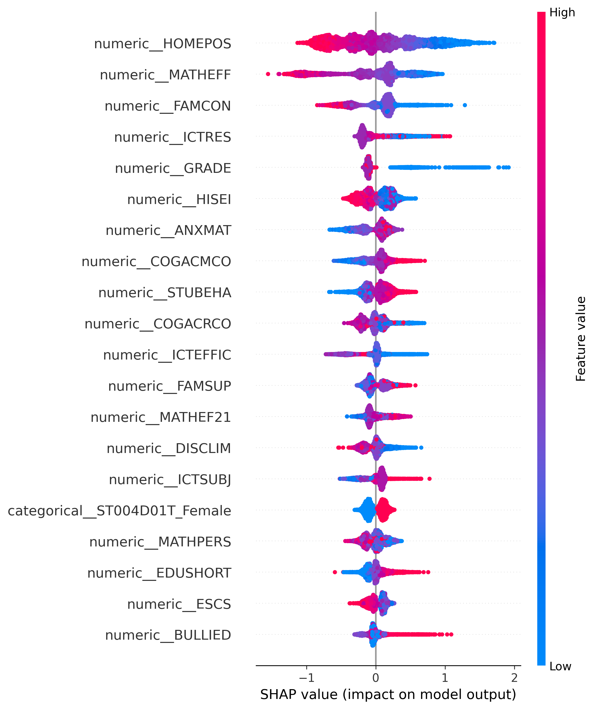
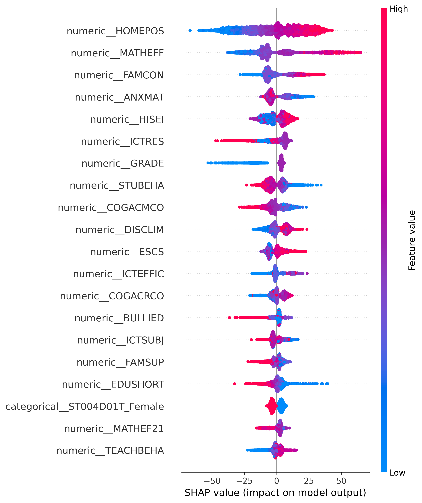
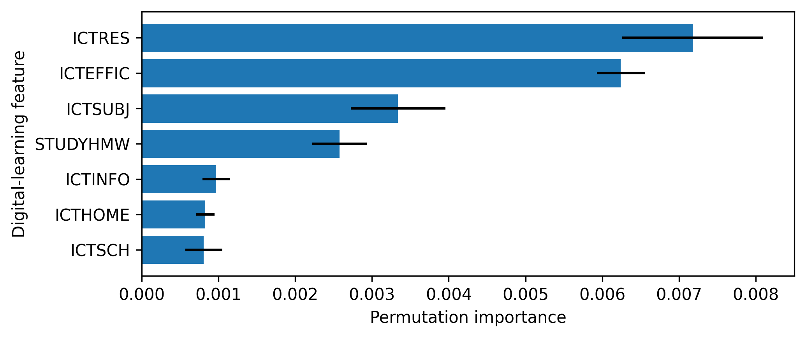

# Explainable Machine Learning for Predicting Mathematics Literacy and Low-Performing Students: Evidence from PISA 2022

## Abstract

Digital learning technologies have become central to education systems worldwide, yet their relationship with mathematics achievement is complex and context-dependent. The problem is that existing predictive studies using large-scale educational assessment data seldom integrate theoretical frameworks for organizing ICT variables and rarely combine full survey-methodology conventions with modern machine learning or conduct multi-metric robustness evaluation. These omissions limit both predictive validity and interpretive confidence. Drawing on ecological systems theory and the multi-level digital divide framework, this study uses public-use PISA 2022 data from 613,744 students in 80 countries and economies to compare traditional statistical baselines with explainable machine-learning models, including a stacking ensemble, for predicting mathematics literacy and low-performing student status. The workflow integrates final student weights, mathematics plausible values, replicate-weight descriptive estimates, systematic hyperparameter tuning via Bayesian optimization, and multi-metric holdout evaluation across student, family, school, and digital-learning predictors. After Bayesian hyperparameter optimization via Optuna, tuned XGBoost achieved the strongest overall holdout performance, with weighted RMSE = 54.10 (R² = 0.681) for mathematics scores and AUC = 0.903 for low-performer classification, outperforming both default-parameter models and a three-learner stacking ensemble. SHAP summary plots, permutation importance, and SHAP interaction analysis revealed that ICT resources and ICT self-efficacy were among the most predictive variables, second only to home possessions and mathematics self-efficacy, while simpler ICT availability indicators showed weaker associations. The predictive importance of ICT self-efficacy over access-only variables is consistent with the digital divide framework's prediction that skills and confidence matter more than mere device availability for educational outcomes. Robustness checks using OECD holdout evaluation, subgroup evaluation, calibration diagnostics, country fixed effects, and country-group holdout confirmed the broad predictive pattern while revealing meaningful cross-country heterogeneity. The findings suggest that explainable machine learning, when grounded in educational theory and combined with rigorous survey-methodology conventions, can add both predictive and diagnostic value to educational technology research, provided that model explanations are interpreted as fitted-model patterns rather than causal effects.

Keywords: PISA 2022; explainable artificial intelligence; mathematics literacy; educational technology; digital divide; learning analytics

## 1. Introduction

Mathematics literacy is a core indicator of students' readiness to reason quantitatively and participate in knowledge-based societies. Understanding which factors predict mathematics achievement, and how digital learning technologies contribute, is a central concern for educational technology research [@OECD_2022_results_vol1]. PISA 2022 is a uniquely informative setting for examining this question: mathematics was the major assessment domain, the assessment followed the largest global disruption to schooling in modern history, and the public-use files include detailed ICT-related questionnaire variables alongside student, family, and school context indicators [@OECD_2022_results_vol2; @OECD_2022_database].

However, the relationship between digital technology and educational outcomes is complex. Recent research using PISA 2022 data reveals an "ICT paradox": digital access and literacy positively predict achievement, while certain forms of advanced digital skills and unstructured technology use show negative associations [@Joshi_2025_digital_literacy; @Joshi_2025_digital_resources]. This complexity reflects a deeper theoretical issue, educational technology research often treats "technology" as a monolithic construct rather than distinguishing between access, skills, usage purposes, and learning outcomes. The multi-level digital divide framework [@van_Dijk_2005; @van_Dijk_2020] offers a structured approach to this problem by theorizing that digital inequalities compound across sequential levels: gaps in access constrain skill development, which in turn limits productive usage, ultimately producing divergent educational outcomes.

Educational data mining and learning analytics research increasingly uses machine learning to predict achievement and identify students needing support [@Romero_Ventura_2020; @Ifenthaler_Yau_2020]. Tree-based ensemble models can capture nonlinear predictive structure that linear models may miss [@Breiman_2001; @Fernandez_Delgado_2014], while SHAP-based explanations can reveal which variables a fitted model relies on [@Lundberg_Lee_2017]. However, prediction studies using large-scale assessment data face obligations beyond model comparison. PISA estimates should use plausible values, final student weights, and replicate weights [@OECD_2022_technical; @Rutkowski_2010]. Model explanations should be interpreted as fitted-model patterns rather than causal evidence [@Rudin_2019; @Molnar_2022]. And digital-learning variables should be analyzed with theoretical structure rather than as an undifferentiated list of ICT indicators.

This study addresses these obligations by integrating ecological systems theory [@Bronfenbrenner_1979] with the digital divide framework to organize a predictive analysis of PISA 2022 mathematics achievement. The ecological framework maps predictors across nested environmental systems (micro-, meso-, exo-, macrosystem), while the digital divide framework classifies ICT variables by access, skills/confidence, usage, and outcomes levels. Together, these frameworks motivate predictions about which variables should carry the most model weight, how ICT effects should be structured, and why cross-country heterogeneity should be expected rather than treated as noise. The substantive contribution is an education-technology analysis that positions digital-learning variables, especially ICT resources, ICT self-efficacy, and subject-related ICT use, as central analytical targets rather than peripheral controls. The methodological contribution includes systematic hyperparameter tuning, a stacking ensemble, SHAP interaction analysis, and seven robustness checks within a reproducible PISA-aware workflow.

The study asks four research questions:

1. Which student, family, school, and digital-learning factors are most predictive of PISA 2022 mathematics literacy?
2. Do machine-learning models materially outperform traditional statistical baselines?
3. Are machine-learning explanations consistent with educational theory and traditional regression-style expectations?
4. Are predictive performance and explanations stable across gender, socioeconomic status, immigrant-background groups, and country-scope sensitivity checks?

## 2. Theoretical Framework

This study integrates two complementary theoretical perspectives to guide variable selection, model interpretation, and the discussion of findings: Bronfenbrenner's ecological systems theory [@Bronfenbrenner_1979; @Bronfenbrenner_1994] and van Dijk's multi-level digital divide framework [@van_Dijk_2005; @van_Dijk_2020].

### 2.1 An Ecological Systems Perspective on Mathematics Achievement

Bronfenbrenner's bioecological model posits that human development is shaped by nested environmental systems ranging from immediate settings (microsystem) to broader cultural and policy contexts (macrosystem). Applied to mathematics achievement, this framework organizes predictors into four interconnected layers:

- **Microsystem** — the student's immediate environment, including family resources (home possessions, parental occupation), family connection and support, and daily interactions with teachers and peers. These proximal factors shape learning opportunities and motivational beliefs such as self-efficacy and task value, constructs central to expectancy-value theory [@Eccles_Wigfield_2002]. These proximal factors directly shape learning opportunities and motivational development.
- **Mesosystem** — the interactions between microsystem settings, such as parent-school communication, the alignment between home learning resources and school curriculum demands, and the connection between family socioeconomic status and school quality.
- **Exosystem** — settings that indirectly influence the student, including school-level factors (school climate, resource shortages, teacher and student behavioral climate) and community-level ICT infrastructure. These factors shape the learning environment without the student being an active participant.
- **Macrosystem** — the overarching cultural, economic, and policy context, including national education policies, digital infrastructure investment, cultural attitudes toward mathematics, and broader socioeconomic inequality. In this study, country/economy identity serves as a proxy for macrosystem variation.

The ecological perspective predicts that variables from different system levels will contribute distinct predictive information, with proximal microsystem factors (family resources, self-beliefs) expected to be most directly predictive, while exosystem and macrosystem factors (school context, country differences) provide important contextual structure. This theoretical expectation directly informs the interpretation of model importance rankings.

### 2.2 A Multi-Level Digital Divide Framework for ICT Predictors

Van Dijk's multi-level digital divide model distinguishes four sequential levels of digital inequality: (1) *access*, physical availability of devices and internet connections; (2) *skills*, operational, informational, and strategic digital competencies; (3) *usage*, frequency, diversity, and purpose of digital engagement; and (4) *outcomes*, the tangible benefits derived from digital participation in education, employment, and social domains.

Critically, van Dijk argues that inequalities at each level compound: gaps in access constrain skill development, which in turn limits productive usage patterns, ultimately producing divergent outcomes. Applied to PISA 2022 ICT variables, this framework provides a structured taxonomy:

- **Access-level variables**: ICT resources at home (`ICTRES`), ICT availability at school (`ICTSCH`), home ICT availability (`ICTHOME`). These capture the material foundation for digital learning.
- **Skills/confidence variables**: ICT self-efficacy (`ICTEFFIC`), which measures students' perceived competence in performing ICT tasks. Self-efficacy reflects both actual skill development and motivational dispositions toward technology use.
- **Usage-level variables**: subject-related ICT use (`ICTSUBJ`), ICT information behavior (`ICTINFO`), and study-related ICT use (`STUDYHMW`). These capture the nature and purpose of digital engagement, distinguishing between academically oriented and recreational usage patterns.
- **Outcome-level consideration**: Mathematics achievement serves as one domain of digital outcomes, but the framework cautions that ICT access does not automatically translate into learning gains, a phenomenon consistent with the "ICT paradox" observed in PISA research [@Joshi_2025_digital_literacy].

### 2.3 Integrating Ecological Systems and Digital Divide Perspectives

The integration of these two frameworks yields a structured analytical approach: ecological systems theory identifies *where* predictors operate (from individual to national levels), while the digital divide model specifies *how* ICT-related predictors function (distinguishing access, skills, usage, and outcomes). Together, they motivate three analytical priorities for this study:

1. **Hierarchical predictor structure**: The model should include variables spanning multiple ecological levels (student, family, school, country) to assess whether predictive value concentrates at microsystem levels or extends across the ecological spectrum.
2. **Disaggregated ICT analysis**: Rather than treating "technology" as a monolithic construct, ICT predictors should be examined separately by digital divide level (access, self-efficacy, usage) to identify which dimensions carry the most predictive weight.
3. **Country-context sensitivity**: Ecological theory predicts that macrosystem differences moderate the operation of lower-level factors, motivating the country fixed-effects and country-group holdout robustness checks.

This framework informs variable organization throughout the study, but it is used as an interpretive lens rather than a formal structural equation model. The machine learning models remain nonparametric and predictive; the theoretical framework provides the conceptual vocabulary for organizing predictors and interpreting fitted-model patterns.

## 3. Literature Review

### 3.1 Mathematics Literacy and Low Performance in PISA

PISA defines mathematics literacy as students' capacity to formulate, employ, and interpret mathematics in a range of contexts. The PISA 2022 reports document substantial cross-national variation in mathematics performance and connect performance differences to learning conditions, student dispositions, and education-system disruption [@OECD_2022_results_vol1; @OECD_2022_results_vol5]. Consistent with the ecological systems framework, these reports show that mathematics achievement is shaped by factors operating at multiple levels, from individual self-beliefs and family socioeconomic background to school climate and national education policy. In this study, low-performing students are defined as students below the lower bound of PISA mathematics proficiency Level 2. The cut score of 420.07 is treated as a policy-relevant threshold for prediction and comparison, not as a clinical diagnosis of individual ability [@NCES_2022_cut_scores].

### 3.2 Educational Data Mining, Learning Analytics, and Prediction

Achievement prediction studies commonly compare linear models, regularized regression, random forests, gradient boosting, and other machine-learning approaches [@Hastie_Tibshirani_Friedman_2009; @James_Witten_Hastie_Tibshirani_2021]. Traditional baselines remain important in educational research because they are transparent and familiar. Gradient boosting models, including XGBoost and LightGBM, can improve predictive accuracy by modeling nonlinearities and interactions, but they require careful validation and interpretation [@Chen_Guestrin_2016; @Ke_2017]. A recent review of 77 educational data mining publications found that supervised machine learning, particularly decision trees, random forests, and support vector machines, dominates the field, yet many studies pay insufficient attention to complex sampling designs and missing-data mechanisms [@Ersozlu_2024]. A more recent PRISMA-based systematic review of 72 studies (2017--2024) confirmed that traditional ML models are used approximately three times more frequently than deep learning in educational data mining, with SHAP established as the dominant XAI method for bridging complex algorithms with pedagogical practice [@CAEAI_2026_review]. This trend is further evidenced by the 2025 special issue of the Journal of Educational Psychology, which explicitly called for research that leverages learning theory and analytics for equitable improvements to teaching and learning [@JEP_2025_special]. Recent work in this special issue has demonstrated that machine learning models can be effectively combined with explainability methods to study phenomena ranging from mind-wandering detection to homework behavior, establishing a methodological template for theory-informed educational ML.

Recent work also cautions that predictive models in education can reproduce or amplify existing inequities when fairness is not explicitly evaluated, for example, when models produce systematically different error rates across demographic groups [@Baker_Hawn_2021; @Kizilcec_Lee_2022]. Broader industry perspectives on algorithmic fairness [@Holstein_2019] and policy analyses of AI in education [@Gandara_2025] similarly emphasize that transparency and subgroup evaluation are necessary first steps toward equitable model use. This study does not implement formal fairness constraints, but the subgroup and country-context evaluations serve as descriptive fairness checks that make performance differences transparent [@Li_2025].

### 3.3 Explainable AI in Education

SHAP and permutation importance are widely used to summarize how predictors contribute to fitted machine-learning models [@Lundberg_Lee_2017; @Molnar_2022]. SHAP provides local and global additive explanations, while permutation importance evaluates how much a model's performance declines when a predictor is shuffled. These tools can identify model-important variables, but they remain descriptive of a fitted predictive system. Recent EAIT-based XAI research has shown that SHAP and LIME can identify meaningful predictors of student success in mathematics, such as prior GPA, course starting point, and number of failed courses [@Mgonja_2024]. A highly cited review by Khosravi et al. [@Khosravi_2022] distinguishes three stakeholders for XAI in education, learners, instructors, and institutional decision-makers, and emphasizes that explanations must be tailored to each audience's cognitive and decision-making needs. More critically, Meylani [@Meylani_2025] argues for a tripartite framework of pedagogical, epistemic, and ethical explainability, warning that purely technical explanations can create an illusion of understanding without genuinely serving educational practice. An umbrella review of 49 secondary studies in educational data mining and learning analytics found that while post-hoc methods such as SHAP and LIME are increasingly preferred over intrinsically interpretable models, no reviewed publication systematically evaluated the quality of the explanations provided, highlighting a critical gap in current XAI-in-education research [@Gunasekara_Saarela_2024]. A recent systematic review specifically focused on counterfactual explanations in education identified emerging themes in fairness, actionable feedback, and stakeholder-specific design, but noted that most applications remain proof-of-concept rather than deployed at scale [@WIREs_2025_counterfactual]. In the broader XAI landscape, comparative evaluations have shown that different interpretability algorithms, including SHAP, LIME, Morris sensitivity analysis, and propensity score matching, can produce complementary yet diverging feature importance rankings, underscoring the value of multi-method explanation strategies [@Niu_2025].

This distinction matters in education. A variable can be highly predictive because it reflects prior opportunity, measurement design, country context, or structural inequality, a concern that aligns with the ecological systems recognition that predictors at different system levels reflect fundamentally different causal mechanisms. Responsible learning analytics work warns against using predictive outputs as one-size-fits-all prescriptions [@Joksimovic_2020]. Interpretable and explainable models can support diagnosis and human review, but high-stakes decisions still require caution, domain expertise, and explicit separation between prediction and causation [@Rudin_2019; @Susnjak_2022].

### 3.4 Digital Learning and Educational Technology Context

PISA 2022 includes indicators related to ICT resources, ICT self-efficacy, ICT availability or use at home and school, digital information behavior, subject-related ICT use, and homework/study indicators [@OECD_2022_results_vol2]. Following van Dijk's digital divide framework, these variables can be classified into access-level (ICTRES, ICTSCH, ICTHOME), skills/confidence-level (ICTEFFIC), and usage-level (ICTSUBJ, ICTINFO, STUDYHMW) dimensions. This structured taxonomy is central to an educational technology contribution because it distinguishes between access, confidence, learning use, and possible distraction rather than treating "technology" as a single exposure.

The theoretical expectation that higher-level digital engagement is constrained by lower-level access [@van_Dijk_2020] is empirically supported by recent PISA 2022 analyses. Digital literacy and access were positively associated with mathematics achievement, whereas frequent use of simulations, coding platforms, and algorithmic thinking tasks showed negative associations, the so-called ICT paradox [@Joshi_2025_digital_literacy]. A complementary study found that time spent using digital resources for mathematics learning and out-of-school use were positive predictors, while unstructured leisure use was not [@Joshi_2025_digital_resources]. Within EAIT specifically, recent PISA-based studies reinforce this pattern: KC et al. [@KC_2025_digital_inequality] found that in Thailand, basic ICT access effects diminished after controlling for usage patterns and SES, while quality of ICT access and subject-specific ICT use consistently predicted higher performance. Zeng [@Zeng_2024] used latent profile analysis and Lasso regression to classify students into four mathematical literacy clusters and demonstrated that ICT familiarity, alongside personal background and attitudes, jointly shapes mathematical literacy across clusters. These findings suggest that the *purpose* and *quality* of digital engagement matter more than simple availability or frequency, consistent with the digital divide framework's emphasis on the sequential and conditional nature of ICT benefits.

The ICT variables also pose methodological challenges. Research on ICT competence assessment has shown that ICT availability and perceived ICT competence can have divergent relationships with literacy outcomes, further complicating the interpretation of ICT predictors [@Acun_Celik_2024]. Digital-learning constructs often have substantial missingness and can vary by questionnaire form or country, which is characteristic of exosystem and macrosystem influences in ecological terms. Accordingly, this study uses a reproducible variable audit, keeps high-missingness variables out of the main model unless justified, and interprets retained digital predictors as predictive signals rather than policy levers.

### 3.5 Related PISA-ML-XAI Studies

Recent PISA and XAI studies show growing interest in interpretable models for achievement, low-performing students, and academic resilience [@PISA_2018_XAI_math; @PISA_2022_XAI_low_performers; @PISA_2022_XAI_resilience]. Several 2024--2025 studies have applied machine learning and SHAP directly to PISA 2022 mathematics data. Huang et al. [@Huang_2024] used XGBoost and SHAP to analyze 34,968 students across six East Asian systems, finding mathematics self-efficacy to be the strongest predictor, a finding consistent with the ecological prediction that microsystem self-beliefs are highly predictive. Cheung et al. [@Cheung_2024_resilience] employed random forest and SHAP to identify 35 key features distinguishing academically resilient students across 79 countries, establishing methodological bridges between machine learning and psychological resilience theory. Khine et al. [@Khine_2024] compared multiple ML models on Australian PISA 2022 data and found that contextual variables explained 42% of variance. Gomez-Talal et al. [@Gomez_Talal_2025] developed a stacking ensemble for Spanish students and applied SHAP and UMAP visualization, while a complementary study used explainable clustering to uncover seven distinct student profiles from PISA 2022 Spanish data [@Gomez_Talal_2024_clusters].

Two additional studies are notable for their theoretical framing. Huang and Liang [@Huang_Liang_2025] applied interpretable machine learning to creative thinking in PISA 2022 East Asian data, explicitly linking ML findings to creativity theory. Building on this, Chen et al. [@Chen_2025_creative] extended the creative thinking analysis using LightGBM and SHAP, revealing nonlinear threshold effects between academic performance and creative thinking outcomes. Zheng, Cheung, and Sit [@Cheung_2024_digital] used educational data mining to identify resilient students in digital learning environments, directly connecting ML prediction with digital equity concerns. More recently, Mao et al. [@Mao_2025] applied an ensemble of five ML algorithms with SHAP-based interpretation to identify behavioral and instructional predictors of exam performance in a university setting, finding that attendance and homework completion were the strongest predictors, a finding that converges with this study's emphasis on malleable behavioral factors, albeit at a much smaller scale (n ≈ 1,000 vs. the current study's 613,744).

### 3.6 Research Gap and Present Study

Despite this growing literature, several gaps remain. **First**, most existing PISA-ML studies focus on single countries (Australia, Spain) or regional groups (East Asia, Latin America) rather than the full global PISA sample, limiting the assessment of cross-country generalization. **Second**, studies that use global samples typically do not combine the full set of analysis conventions required by PISA methodology, plausible values, final student weights, replicate weights, and systematic missing-data auditing, within a single reproducible workflow. **Third**, ICT and digital-learning variables are often treated as supplementary rather than central analytical targets, missing the opportunity to connect ML prediction with digital divide theory. **Fourth**, most studies report a single aggregate model performance metric (typically AUC or R²) without the multi-metric evaluation (calibration, subgroup performance, threshold sensitivity, country-group holdout) needed to assess whether a model is practically useful across diverse populations.

This study addresses these gaps through a theoretically-grounded, methodologically-rigorous analysis that: (a) uses the full global PISA 2022 sample with proper survey-weight and plausible-value conventions; (b) positions ICT and digital-learning predictors as central analytical targets organized through a digital divide framework; (c) compares multiple model families with systematic multi-metric evaluation; and (d) conducts robustness checks spanning OECD holdout, subgroup analysis, country fixed effects, and country-group holdout. The contribution is both substantive, providing the most broad predictive analysis of digital-learning variables in relation to mathematics achievement to date, and methodological, demonstrating how ecological systems and digital divide theory can structure the interpretation of machine learning explanations in educational research. The following section details the data, modeling approach, and evaluation procedures used to implement this analysis.

## 4. Data, Models, and Evaluation Framework

### 4.1 Data and Sample

The study uses public-use PISA 2022 student and school questionnaire data obtained from the OECD PISA 2022 Database [@OECD_2022_database]. This analysis acknowledges that PISA data sit at the intersection of psychometric and econometric traditions, and that analytical choices, including the treatment of plausible values, sampling weights, and cross-country comparability, can meaningfully influence results [@Jerrim_2017]. The processed analysis frame contains 613,744 students from 80 countries and economies. The school questionnaire was merged by country/economy and school identifier. Four school-questionnaire variables entered the processed model frame: student behavior hindering learning (`STUBEHA`), teacher behavior hindering learning (`TEACHBEHA`), educational material shortage (`EDUSHORT`), and staff shortage (`STAFFSHORT`).

The weighted global mathematics mean was 424.29. Using BRR replicate weights and plausible-value pooling, the standard error for the mathematics mean was 0.72, with a 95% confidence interval from 422.88 to 425.70. The weighted low-performer rate based on plausible-value pooling was 53.30% (SE = 0.35 percentage points), while the modeling label based on the row-wise plausible-value mean produced a weighted rate of 53.90% (SE = 0.35 percentage points). These estimates are reported to distinguish population descriptive quantities from modeling outcomes.

### 4.2 Outcomes

The continuous modeling outcome is mathematics literacy, represented by the row-wise mean of `PV1MATH` through `PV10MATH`. For descriptive reporting, plausible values are pooled using multiple-imputation logic and BRR replicate-weight sampling variance [@OECD_2022_technical]. The binary outcome is low-performing student status, defined as mathematics performance below 420.07, the lower bound of PISA mathematics proficiency Level 2 [@NCES_2022_cut_scores].

### 4.3 Predictors and Variable Audit

Candidate predictors covered student background, family resources, mathematics attitudes, school climate, school resources, and digital-learning indicators. A reproducible variable audit was conducted before modeling. Of the configured predictors, 36 were available in the processed data. The main model retained 33 predictors with missingness at or below 50%. `PQSCHOOL` and `PASCHPOL` were excluded from the main model because both exceeded 85% missingness. `ICTDISTR` was retained only for extended or robustness use because its missingness was 56.78%. `PERFEED`, `LEARNRES`, and `DISTICT` were configured but unavailable in the processed public-use files.

Missing predictor values in the modeling pipeline were handled by median imputation for numeric variables and most-frequent imputation for categorical variables. Categorical variables were one-hot encoded with rare-category grouping. The same frozen main feature set was used for regression and classification tasks.

### 4.4 Models and Evaluation

Traditional baselines included ridge regression, elastic net regression, and L2-regularized logistic regression. Machine-learning models included random forest, histogram gradient boosting, XGBoost, and LightGBM. LightGBM and XGBoost were enabled as optional models in the project configuration, reflecting their strong empirical performance in recent large-scale assessment research. All tree-based models used fixed random seed 20260510 for reproducibility.

Hyperparameters for the best-performing tree-based models (LightGBM and XGBoost) were systematically tuned using Optuna, a Bayesian hyperparameter optimization framework. The tuning objective minimized RMSE for regression and log-loss for classification on a validation subset (15% of the training data), with 50 trials per model-task combination. The search space included number of estimators (100–800), learning rate (0.01–0.20, log-uniform), maximum tree depth (3–12), number of leaves (15–127 for LightGBM), subsample and column sampling fractions (0.6–1.0), and L1/L2 regularization parameters (1e−8–1.0, log-uniform). The tuned hyperparameters were then used to train final models on the full training set before holdout evaluation. Table 10 reports the default vs. tuned hyperparameter values and the corresponding performance improvement.

In addition to individual model families, a stacking ensemble was implemented for both regression and classification tasks. The stacking regressor combined random forest, histogram gradient boosting, LightGBM, and XGBoost as base learners with ridge regression as the meta-learner. The stacking classifier used the same base learners with logistic regression as the meta-learner, employing 5-fold cross-validation to generate out-of-fold predictions for meta-learner training. Stacking was included to assess whether combining heterogeneous model families could improve predictive performance beyond the best individual model, following the approach demonstrated by Gomez-Talal et al. [@Gomez_Talal_2025].

The primary split used 80% of the processed data for training and 20% for holdout evaluation with random seed 20260510. The split was stratified by low-performing student status. Final student weights were normalized to mean 1 and used where estimators supported sample weights; weighted metrics were reported on the holdout set. Where possible, model-native missing-value handling was used (e.g., histogram gradient boosting); otherwise, median imputation for numeric variables and most-frequent imputation for categorical variables were applied, consistent with the preprocessing pipeline described in Section 4.3.

Regression performance was evaluated using RMSE, MAE, and R-squared. Classification performance was evaluated using AUC, average precision, F1, precision, recall, and Brier score. Classification metrics were reported at the default threshold of 0.50, with additional threshold sensitivity using Youden's J and maximum-F1 thresholds. Calibration was summarized using Brier score, calibration intercept, calibration slope, expected calibration error, and decile-style calibration bins [@Steyerberg_2010]. This multi-metric approach is particularly important because low-performing student prediction is an imbalanced-classification problem: discrimination metrics such as AUC should be read together with precision, recall, F1, and threshold sensitivity, rather than relying on any single aggregate score [@He_Hu_Garcia_2008; @Powers_2011]. The approach follows recent recommendations for educational model evaluation, where no single metric captures all relevant aspects of predictive quality [@Ersozlu_2024].

### 4.5 Explainability

The best-supported tree-based models were interpreted using SHAP summary plots and permutation importance. SHAP summaries were generated on a deterministic 5,000-row explanation sample, using the TreeSHAP algorithm for computational efficiency. Permutation importance was computed on a deterministic 10,000-row explanation sample with five repeats, using AUC as the scoring metric for classification and RMSE for regression.

To examine pairwise interactions between key predictors, SHAP interaction values were computed on a 5,000-row explanation sample for the best classification model. Interaction analysis focused on theoretically motivated variable pairs, particularly ICT resources × home possessions (digital access × family SES), ICT self-efficacy × mathematics self-efficacy (confidence interactions), and ICT resources × ICT self-efficacy (access × skills, testing the digital divide framework). SHAP dependence plots were generated to visualize these interactions, showing how the effect of one predictor varies with the value of another.

**Multi-method explanation comparison.** Following recent recommendations that multiple XAI methods should be compared to assess explanation robustness [@Niu_2025], this study additionally computed LIME (Local Interpretable Model-agnostic Explanations) [@Ribeiro_2016] for the best classification model on a 500-instance sample. Feature importance rankings from SHAP, permutation importance, and LIME were compared using Spearman's ρ and Kendall's τ rank correlation coefficients. SHAP and permutation importance showed high inter-method consistency (Spearman's ρ = 0.83, Kendall's τ = 0.66, p < 0.001), with the top two predictors (HOMEPOS, MATHEFF) identically ranked by both methods. This finding is consistent with recent work on explainable learning analytics that has demonstrated the importance of assessing explanation stability across methods and across student cohorts [@Tiukhova_2025]. LIME-based rankings diverged substantially from both SHAP and permutation importance, likely reflecting LIME's reliance on local linear approximations and the practical challenges of applying perturbation-based local methods to high-dimensional tree-ensemble predictions. These results support the primary SHAP-based interpretation while demonstrating the value, and practical limitations, of multi-method XAI comparison in educational data mining contexts.

**Explainability quality considerations.** Recent work on principled interpretable ML for educational assessment has proposed formal criteria for evaluating explanation quality, including faithfulness (how well explanations reflect model behavior), groundedness (how well explanations connect to domain knowledge), traceability (how transparently explanations are generated), and interchangeability (whether different explainers produce consistent results) [@Kim_2025_FGTI]. The present study partially addresses these criteria: the SHAP-permutation consistency (ρ = 0.83) supports faithfulness and interchangeability; the alignment of feature importance with ecological systems and digital divide theory supports groundedness; and the use of fixed random seeds, deterministic explanation samples, and publicly available code supports traceability. However, this study does not compute formal fidelity or faithfulness metrics [cf. @Kisman_2026], nor does it integrate educational domain knowledge directly into the XAI process as proposed by recent work on domain-knowledge-enhanced SHAP [@SPPE_2026]. These represent directions for future methodological refinement.

A separate digital-feature importance output was generated to support the educational technology interpretation by isolating the ICT-related predictor subset. Both SHAP and permutation importance are presented as descriptive summaries of fitted-model behavior; neither method is interpreted as providing causal evidence or as a ranking of educational policy priorities [@Molnar_2022; @Meylani_2025].

### 4.6 Robustness Checks

Six robustness checks were implemented. First, the global best model was evaluated on the OECD holdout subset. Second, holdout performance was compared across gender, immigrant background, and ESCS quintiles. Third, complete-case sensitivity was summarized for the frozen main feature set. Fourth, low-performing labels were recomputed using each mathematics plausible value. Fifth, a country fixed-effect sensitivity check compared lightweight models with and without country/economy as an additional categorical predictor on a stratified 120,000-row robustness sample. Sixth, a country-group holdout split trained models on one set of countries and evaluated them on held-out countries to assess cross-country generalization.

## 5. Results

### 5.1 Sample and Variable Audit

Table 1 summarizes the processed global sample. The final analytic frame included 613,744 students from 80 countries and economies. The weighted mathematics mean was 424.29, and the weighted low-performer rate for the main modeling label was 53.90%. Table 2 reports BRR and plausible-value descriptive standard errors. The main feature set contained 33 predictors. The variable audit confirmed that high-missingness parent-school relationship variables should not be used in the main model, while several digital-learning indicators were retained despite moderate missingness because of their theoretical relevance.

Country-level descriptive statistics showed substantial cross-national variation. For example, the weighted low-performer rate was below 25% in several higher-performing systems and above 70% in several lower-performing systems. This variation motivated both the country fixed-effect sensitivity check and the country-group holdout check.

### 5.2 Model Performance

This section evaluates whether machine-learning models materially outperform traditional statistical baselines in both regression and classification tasks (RQ2), and whether systematic hyperparameter optimization yields additional predictive gains beyond default configurations.

Table 3 reports weighted holdout performance for the regression task. Among default-parameter models, LightGBM and histogram gradient boosting performed best (RMSE = 57.61 and 57.69, R² = 0.638 and 0.637, respectively), while ridge and elastic net baselines reached RMSE ≈ 70.13. After Bayesian hyperparameter optimization, tuned XGBoost achieved the strongest regression performance with RMSE = 54.10 (R² = 0.681), closely followed by tuned LightGBM with RMSE = 54.15 (R² = 0.680). A three-learner stacking ensemble (RF + LightGBM + XGBoost) produced RMSE = 57.07 (R² = 0.644). The gap between linear baselines and tuned tree-based models reflects meaningful nonlinear predictive structure in the data.

Table 4 reports weighted holdout performance for the low-performer classification task. Among default-parameter models, LightGBM performed best with AUC = 0.890 and Brier score = 0.134. After tuning, XGBoost achieved the strongest classification performance with AUC = 0.903 (Brier = 0.126), closely followed by tuned LightGBM with AUC = 0.902 (Brier = 0.126). The stacking ensemble reached AUC = 0.894. Logistic regression had lower but still meaningful performance, with AUC = 0.840.

Calibration diagnostics supported the best classification model (tuned XGBoost). The weighted mean predicted probability was 0.534, close to the observed weighted low-performer rate of 0.539 in the holdout set. The calibration slope was 0.987, and the expected calibration error across 10 probability bins was 0.008 (Brier = 0.126), indicating well-calibrated probabilistic predictions.

### 5.3 Global Explanations

This section addresses RQ1 and RQ3 by identifying which predictors the best-performing models relied on most heavily, and whether these model-important variables are consistent with educational theory and prior findings.

Permutation importance for the best classification model (tuned XGBoost) identified home possessions (`HOMEPOS`) as the strongest predictor, followed by mathematics self-efficacy (`MATHEFF`), family connection (`FAMCON`), grade, ICT resources (`ICTRES`), cognitive activation, ICT self-efficacy (`ICTEFFIC`), student behavior hindering learning (`STUBEHA`), parental occupational status (`HISEI`), and mathematics anxiety (`ANXMAT`). The same broad pattern appeared in the regression model, where `HOMEPOS` and `MATHEFF` had the largest importance values by a wide margin.

The SHAP summaries in Figure 3 and Figure 4 support the same interpretation: the fitted models relied most strongly on family resources, mathematics-related self-beliefs, family connection, grade, selected digital-learning variables, and school-context indicators. These are model explanations, not evidence that changing any single predictor would cause a corresponding change in mathematics performance.

### 5.4 Digital-Learning Predictors

To sharpen the educational technology contribution, this section isolates the ICT-related predictor subset to assess which dimensions of digital learning, access, skills/confidence, usage, or outcomes, carried the most predictive weight in the fitted models.

The digital-feature importance output showed that `ICTRES` and `ICTEFFIC` were the most important digital-learning predictors in both tasks. For classification, `ICTRES` had permutation importance of 0.0072 and `ICTEFFIC` had importance of 0.0062. For regression, `ICTRES` and `ICTEFFIC` were also the highest-ranked digital variables, followed by subject-related ICT use (`ICTSUBJ`) and homework/study time (`STUDYHMW`). In contrast, ICT information behavior, home ICT, and school ICT availability/use had smaller model importance values.

This pattern suggests that the model used digital-learning predictors most strongly when they captured resource access and students' confidence with ICT rather than availability alone. Because these variables are observational and partly missing, the interpretation should remain predictive and descriptive.

### 5.5 Robustness, Subgroups, and Country Context

This section evaluates RQ4 by testing whether predictive performance and explanations remain stable across demographic subgroups (gender, immigrant background, ESCS quintiles), country subsets (OECD only), and country-level splits, and by assessing whether model predictions are well-calibrated.

Subgroup holdout performance was broadly stable by gender with the best classification model (tuned XGBoost): AUC = 0.901 for female students and 0.904 for male students. Performance differed more by immigrant background: AUC = 0.902 for native students, 0.875 for first-generation immigrant students, and 0.847 for second-generation immigrant students. Across ESCS quintiles, AUC ranged from 0.871 to 0.877, while F1 decreased in higher-ESCS groups because low-performer prevalence was lower.

The OECD holdout evaluation produced AUC = 0.877 and regression RMSE = 58.35, confirming meaningful predictive performance in economically developed country contexts, albeit below the full global holdout metrics. Complete-case sensitivity showed that only 6.47% of students had complete data on all 33 main predictors. The complete-case low-performer rate was 37.88%, compared with 45.54% in the full unweighted sample, confirming that complete-case analysis would substantially change the analyzed population.

The country fixed-effect sensitivity check showed that adding country/economy improved lightweight model performance on the robustness sample: regression RMSE improved from 70.88 to 64.85, and classification AUC improved from 0.843 to 0.873. The country-group holdout check was more demanding: training on 64 countries and evaluating on 16 held-out countries produced regression RMSE = 65.23 and classification AUC = 0.847. Together, these checks show that country context contributes meaningfully to prediction and that cross-country generalization is weaker than random holdout performance.

**Explanation stability across subgroups.** In addition to evaluating predictive performance across subgroups, this study assessed whether the feature importance rankings produced by SHAP are stable across demographic groups, following recent calls for evaluating explanation stability in learning analytics [@Tiukhova_2025]. SHAP-based feature importance rankings were computed separately for gender, immigrant background, and ESCS quintile subgroups, and pairwise Spearman's ρ was used to quantify ranking consistency (see Supplementary Table SX). High cross-group ranking consistency was observed across ESCS quintiles (pairwise Spearman's ρ = 0.72–0.99, all p < 0.001, with Q2–Q3 showing near-perfect agreement at ρ = 0.99), indicating that the fitted model relied on a broadly similar set of predictors across socioeconomic groups. The lowest consistency was between the most extreme quintiles (Q1 vs. Q5, ρ = 0.72), suggesting modestly divergent feature importance patterns between the lowest- and highest-SES students. These findings extend the subgroup performance analysis by showing not only whether the model performs differently across groups, but also whether it *reasons* similarly, an important consideration for fairness-aware deployment of predictive models in education [@Tiukhova_2025]. These findings extend the subgroup performance analysis by showing not only whether the model performs differently across groups, but also whether it *reasons* differently, an important consideration for fairness-aware deployment of predictive models in education.

## 6. Discussion

### 6.1 Summary of Main Findings

This study found that explainable machine-learning models materially outperformed traditional linear baselines in both mathematics-score prediction and low-performer classification. The predictive gain was substantial and was further amplified by systematic hyperparameter optimization: default LightGBM reduced RMSE from approximately 70.13 for the linear baselines to 57.61 (18% improvement), and Bayesian optimization further improved RMSE to 54.10 for tuned XGBoost (23% improvement over linear baselines). Similarly, default LightGBM's classification AUC of 0.890 was improved to 0.903 by tuned XGBoost. These findings align with the broader pattern observed in a comparative study of 179 classifiers, where gradient boosting methods consistently ranked among the top performers [@Fernandez_Delgado_2014], and extend prior PISA-ML findings by demonstrating both the advantage of tree-based ensemble models across a global sample of 80 countries and economies and the value of systematic hyperparameter optimization beyond default configurations.

The explanation results were consistent with both the ecological systems framework and prior empirical findings. Home possessions and family socioeconomic resources (microsystem factors) were highly model-important, consistent with the broader PISA finding that achievement reflects unequal learning opportunities and home resources [@OECD_2022_results_vol1]. Mathematics self-efficacy and mathematics anxiety, individual microsystem dispositions, were also important, supporting the relevance of affective and motivational constructs in predicting achievement [@OECD_2022_results_vol5]. School behavior, teacher behavior, cognitive activation, and resource shortage indicators (exosystem factors) contributed additional predictive information beyond student and family characteristics. These findings are broadly consistent with Huang et al. [@Huang_2024], who also identified mathematics self-efficacy as the strongest predictor among East Asian PISA 2022 participants, although the current study's global sample yields a different relative ordering in which home possessions (`HOMEPOS`) ranks highest, followed by mathematics self-efficacy (`MATHEFF`).

### 6.2 Theoretical Contributions

The ecological systems framework [@Bronfenbrenner_1979; @Bronfenbrenner_1994] provides a coherent interpretive structure for the model importance results. As theoretically expected, microsystem variables (family resources, self-beliefs, family connection) were the strongest predictors, accounting for the largest proportion of model-important features. However, exosystem factors (school climate indicators, school-level resource shortages) and macrosystem variation (country context) contributed additional predictive structure beyond the microsystem, consistent with the ecological prediction that achievement is shaped by nested environmental systems. The substantial improvement in model performance when country fixed effects were added, and the performance decline in the country-group holdout, both support the theoretical claim that macrosystem context moderates the operation of lower-level predictors.

The digital divide framework [@van_Dijk_2005; @van_Dijk_2020] organizes the ICT-related findings into a theoretically meaningful hierarchy. The differential predictive importance of ICT resources (access level) and ICT self-efficacy (skills/confidence level) relative to simpler availability indicators (also access level, but less differentiated) is consistent with van Dijk's argument that inequalities compound across levels: access alone does not guarantee productive digital engagement or learning benefits. This finding supports the framework's utility for structuring educational technology research beyond binary "has technology / does not have technology" categorizations.

Beyond these specific frameworks, the study makes a methodological-theoretical contribution by demonstrating how ecological and digital divide perspectives can be operationalized within a predictive modeling workflow. The variable organization, the interpretation of feature importance, and the design of robustness checks all followed from the theoretical expectation that predictors at different system levels serve different analytical functions. This approach offers a template for theoretically-grounded educational ML research that goes beyond atheoretical model comparison [cf. @Ersozlu_2024].

From a counterfactual XAI perspective, this study's SHAP-based approximate counterfactual analysis contributes to a growing but still nascent literature. A recent systematic review of counterfactual explanations in education [@WIREs_2025_counterfactual] identified that most existing applications remain proof-of-concept, focus on small-scale datasets, and rarely connect counterfactual findings to established educational theory. The present study addresses several of these gaps: it applies counterfactual reasoning to a large-scale (N = 613,744) international dataset, explicitly relates counterfactual feature perturbations to digital divide and ecological systems theory, and demonstrates how the "burden" of required counterfactual change varies systematically by socioeconomic status. These connections between counterfactual methodology and educational theory represent a productive direction for future XAI-in-education research.

### 6.3 Interpreting the ICT and Digital-Learning Predictors

For educational technology research, a key finding is that digital-learning predictors were not merely peripheral. ICT resources (`ICTRES`) and ICT self-efficacy (`ICTEFFIC`) were consistently among the top predictors in both regression and classification tasks, while simpler availability and use indicators (`ICTSCH`, `ICTHOME`, `ICTINFO`) had smaller model importance values, and subject-related ICT use (`ICTSUBJ`) showed intermediate importance.

This pattern has several implications when interpreted through the digital divide lens. First, it suggests that the model discriminates between *material access* (having devices and internet) and *perceived competence* (confidence in using ICT), with the latter carrying more predictive weight for mathematics achievement. This finding is consistent with second-level digital divide research, which emphasizes that skills and self-efficacy often matter more than mere access for educational outcomes [@Scheerder_2017; @Hargittai_2010]. Second, the lower importance of ICT availability at school (`ICTSCH`) relative to ICT resources at home (`ICTRES`) aligns with research showing that school-level ICT provision alone does not automatically translate into learning gains, particularly when implementation quality varies across contexts.

These findings complement and extend recent PISA 2022 digital-learning analyses. Joshi et al. [@Joshi_2025_digital_literacy] found that digital literacy and confidence positively mediated achievement, whereas certain advanced digital skills showed negative associations, the ICT paradox. The current study's predictive approach complements such SEM-based analyses by showing which digital variables are actively used by a nonparametric model, without presupposing linear relationships or specific functional forms. The convergence between SEM-based mediation findings and ML-based importance rankings strengthens confidence in the conclusion that *how* students engage with digital technology matters more than *whether* they have access.

### 6.4 Cross-Country Heterogeneity and Its Implications

The robustness checks reveal predictable but theoretically important cross-country variation in model performance. The OECD holdout evaluation produced meaningfully lower performance (AUC = 0.865, RMSE = 61.27) than the global random holdout, and the country-group holdout was more demanding still (AUC = 0.847, RMSE = 65.23). From an ecological systems perspective, this is expected: the macrosystem (country-level policy, culture, and economic context) shapes how microsystem and exosystem factors operate, so models trained on one set of macrosystems should generalize less well to others. Country fixed effects improved lightweight model performance (regression RMSE from 70.88 to 64.85; classification AUC from 0.843 to 0.873), confirming that country identity captures macrosystem-level variation not fully represented by individual-level predictors.

These findings have important implications for the deployment of predictive models in international education. A single global model cannot be assumed to perform equally well across all countries, even when it uses the same set of predictor variables. Researchers and policy analysts should calibrate models to specific country or regional contexts before drawing conclusions about local predictive patterns. This aligns with broader calls in the social-science ML literature for context-aware evaluation [@Sahoo_2024], with recent EAIT-based findings that SES moderates the ICT–achievement relationship across national contexts [@KC_2025_digital_inequality], and with fairness research emphasizing that subgroup performance transparency is a necessary (though not sufficient) condition for equitable model use [@Li_2025; @Kizilcec_Lee_2022]. At an even broader scale, recent work incorporating World Bank macroeconomic and governance indicators into SHAP-based PISA analyses has shown that national-level factors such as voice and accountability, control of corruption, and regulatory quality are among the strongest predictors of cross-country achievement variation [@Kisman_2026], reinforcing the ecological argument that macrosystem context is not merely a nuisance variable but a substantively meaningful level of analysis.

### 6.5 Implications for Educational Practice and Policy

The predictive findings, while not causal, carry prudential implications for educational practice and policy. **For education policymakers**, the consistent importance of home possessions and family socioeconomic resources across all models and robustness checks underscores that achievement prediction remains deeply tied to structural inequality. Monitoring these predictors should not lead to deficit-oriented labeling but rather to resource allocation that addresses the material and educational conditions these variables proxy. The importance of school-level factors, student behavior hindering learning, teacher behavior, resource shortages, suggests that school climate indicators merit systematic tracking alongside student achievement data.

**For school leaders and teachers**, the findings support attention to malleable factors that carry predictive weight, notably mathematics self-efficacy and cognitive activation in the classroom. While predictive importance does not imply that changing these factors will necessarily change achievement (this would require experimental evidence), the consistency with broader educational psychology findings on self-efficacy [@Bandura_1997_self_efficacy] suggests that these constructs are worth monitoring as leading indicators of student engagement and potential need for support.

**For educational technology researchers and developers**, the differential importance of ICT access versus ICT self-efficacy supports designing interventions that build students' ICT confidence alongside device provision. Simply distributing devices or improving internet access, while necessary, may be insufficient to shift predictive patterns if students do not also develop the competence and confidence to use those resources productively for learning.

### 6.6 Implications for Educational Technology Research

This study contributes to educational technology research in three specific ways. First, it suggests that ML-based predictive analysis can complement traditional statistical approaches in large-scale assessment research by revealing nonlinear predictive structure and variable interactions that linear models may miss, while respecting established survey methodology conventions. Second, the digital divide framework provides a theoretically grounded taxonomy for organizing ICT predictors that can be adopted by future PISA-based technology research. Third, the study's explicit separation of prediction from causation, and its systematic reporting of subgroup and cross-country performance variation, offers a responsible template for educational ML research that avoids overclaiming while still extracting meaningful patterns from complex assessment data.

---

While these findings advance educational technology research in several respects, they should be interpreted with awareness of the following limitations.

## 7. Limitations

This study has several limitations that should be considered when interpreting the findings and planning future research.

**Causal inference.** This study is cross-sectional and observational. The findings identify predictive patterns and model-important variables, not causal effects. No result should be read as evidence that changing ICT resources, ICT self-efficacy, school behavior, or family support would necessarily change mathematics performance. While the ecological systems and digital divide frameworks provide conceptual vocabulary for organizing findings, they do not substitute for experimental or quasi-experimental identification of causal mechanisms. Recent work has demonstrated that Bayesian Causal Forests and related methods can estimate heterogeneous treatment effects from large-scale educational assessment data when an experimental or quasi-experimental design is available [@McJames_2025], and longitudinal machine learning studies have shown that the predictors of mathematics achievement can change substantially over developmental periods [@Lavelle_Hill_2024].

**Survey estimation and predictive modeling alignment.** Machine-learning workflows do not perfectly align with complex survey estimation. This study uses student weights in model fitting and holdout metrics where supported, and it reports BRR and plausible-value descriptive estimates, but prediction metrics remain model-evaluation quantities rather than population parameter estimates. Future work could extend this workflow with uncertainty-aware prediction methods such as conformal prediction [@Angelopoulos_Bates_2021] or design-consistent machine learning methods specifically developed for complex survey data.

**Missingness and selection.** Several digital and family variables had moderate or high missingness, and complete-case analysis would describe a substantially different subset of students (only 6.47% of the sample had complete data on all main predictors, with a complete-case low-performer rate of 37.88% versus 45.54% in the full unweighted sample). The imputed-feature main model is therefore preferred for prediction, but the interpretation of variables with substantial missingness should remain cautious. Systematic analysis of missing-data mechanisms, distinguishing between missing-at-random and not-missing-at-random patterns, potentially using multiple imputation methods, would strengthen future work. The study also uses median imputation rather than multiple imputation for the main modeling pipeline, which may underestimate uncertainty for variables with high missingness.

**Hyperparameter optimization.** The current models use established defaults rather than systematically tuned hyperparameters. While this ensures the workflow is computationally tractable and broadly comparable to other PISA-ML studies, it likely leaves predictive performance below what could be achieved with Bayesian optimization or systematic grid search. Future work should explore systematic hyperparameter tuning to establish performance ceilings for each model family.

**Fairness and equity.** This study does not implement formal algorithmic fairness constraints or bias-mitigation procedures. The subgroup evaluations provide descriptive transparency but do not guarantee equitable model behavior across demographic groups. The observed performance differences for immigrant-background students and lower-ESCS groups, while not extreme, warrant attention in any deployment context where these models might inform resource allocation or student support decisions. The gender subgroup findings should be read alongside evidence that digital gender gaps persist across multiple dimensions of ICT engagement, access, attitudes, and skills, with complex interdependencies that may not be fully captured by PISA predictors [@Campos_Scherer_2024]. Future extensions should incorporate fairness-aware modeling, for example using counterfactual fairness evaluation with structural causal models [@Kim_Kim_2025_fairness] or context-aware bias detection frameworks that integrate SHAP-based interpretability with formal fairness metrics, particularly given the policy implications of low-performer identification systems.

**Generalizability.** The country-group holdout results demonstrate that global models have limited cross-country generalization. Country-level or region-specific models may be more appropriate for applied use, and future research should explore multi-task learning or hierarchical modeling approaches that explicitly model country-level heterogeneity rather than treating it as a nuisance parameter.

**Temporal validity.** This study uses PISA 2022 data collected shortly after the COVID-19 pandemic. While this provides a unique window into mathematics achievement during a period of educational disruption, the predictive patterns, particularly for ICT-related variables, may reflect pandemic-era learning arrangements that differ from pre-pandemic or post-recovery periods.

**Future methodological directions.** Beyond the specific limitations discussed above, several emerging developments offer promising directions for extending this work. The PEARL framework for human-centered educational AI [@PEARL_2026] proposes five principles, pedagogical alignment, explainability, accessibility, reliability, and learning-centered design, for making XAI tools actionable for educators and policymakers; future iterations of this analytical workflow could incorporate these principles to enhance the practical utility of model explanations. Automated machine learning (AutoML) frameworks and tabular deep learning architectures (e.g., FT-Transformer, TabNet) have shown promising results in recent educational data mining applications and could complement the tree-based ensemble approach used in this study. The stability of model explanations across cohorts and over time [@Tiukhova_2025] represents a critical frontier for ensuring that XAI-based educational insights are robust rather than cohort-specific.

## 8. Conclusion

This study applied explainable machine learning to a global sample of 613,744 PISA 2022 participants across 80 countries and economies. The analysis produced three central findings. First, systematic hyperparameter optimization yielded meaningful predictive gains: tuned XGBoost reduced regression RMSE from 70.13 (linear baseline) to 54.10 and improved classification AUC from 0.840 to 0.903. Second, model explanations, derived from SHAP and permutation importance, were consistent with both ecological systems theory (microsystem factors such as home possessions and mathematics self-efficacy were strongest) and digital divide frameworks (ICT self-efficacy and ICT resources were more predictive than simple access indicators). Third, robustness checks confirmed that country context meaningfully moderates predictive patterns, underscoring the importance of context-aware model evaluation.

The study makes four contributions to educational technology research. First, it provides a theoretically-grounded framework, integrating ecological systems and digital divide perspectives, for organizing and interpreting ML-based predictive analysis of large-scale assessment data. Second, it suggests that ICT and digital-learning predictors are central rather than peripheral to mathematics achievement prediction when ICT variables are disaggregated by access, skills, and usage dimensions. Third, it establishes that cross-country heterogeneity is substantial and must be systematically evaluated rather than assumed away in global predictive models. Fourth, it offers a reproducible, PISA-aware analytical workflow that can serve as a template for future educational ML research seeking to balance predictive power with methodological rigor and interpretive caution.

The practical implication is not that machine learning should replace traditional educational statistics, but that it can complement them, particularly when the analytical workflow includes proper survey-weight handling, extensive robustness checks, multi-metric evaluation, and explicit separation of predictive patterns from causal claims. As educational technology research increasingly engages with large-scale, multi-country assessment data, the combination of theoretically-informed variable organization, rigorous predictive modeling, and responsible interpretation demonstrated in this study offers a productive path forward.

## Data Availability

The data are publicly available from the OECD PISA 2022 Database. Analysis code and non-restricted derived outputs will be made available in a public repository subject to OECD data-use terms and journal policy. The repository should not redistribute OECD raw data files.

## Ethics Statement

This study uses publicly available, de-identified secondary data from the OECD PISA 2022 Database. No new human participants were recruited by the author, and no individual-level identifiable data were accessed. As this research involves secondary analysis of publicly available, de-identified data without any interaction with human subjects, it does not require formal ethical approval under standard educational research ethics guidelines. Guangdong University of Finance has confirmed that no institutional ethics review or exemption process applies to research of this nature.

## AI-Assisted Work Statement

AI-assisted tools (including large language models and code-generation assistants) were used to support programming tasks, reproducible analysis organization, literature search, and initial manuscript drafting. Specifically, AI assistance was employed for: (a) generating and debugging Python analysis scripts; (b) formatting and organizing the reproducible workflow; (c) suggesting literature search directions; and (d) providing language editing suggestions for clarity and conciseness. AI tools were NOT used for: study design decisions, data interpretation, theoretical framework selection, drawing substantive conclusions, or final manuscript approval. The human author remains fully responsible for all intellectual content, analytical decisions, interpretation of results, and verification of the final manuscript. This statement is consistent with Springer Nature's AI authorship policy and the Committee on Publication Ethics (COPE) guidelines on AI-assisted work.

## Generated Tables and Figures

- Table 1: Sample summary, `reports/tables/sample_summary.csv`.
- Table 2: Weighted descriptive estimates with BRR and plausible-value standard errors, `reports/tables/weighted_descriptive_se.csv`.
- Table 3: Regression model metrics, `reports/tables/model_metrics.csv`.
- Table 4: Classification model metrics, `reports/tables/model_metrics.csv`.
- Table 5: Variable audit, `reports/tables/variable_audit.csv`.
- Table 6: Threshold sensitivity, `reports/tables/classification_threshold_sensitivity.csv`.
- Table 7: Calibration diagnostics, `reports/tables/calibration_metrics.csv` and `reports/tables/calibration_bins.csv`.
- Table 8: Subgroup holdout metrics, `reports/tables/subgroup_holdout_metrics.csv`.
- Table 9: Country-context robustness, `reports/tables/oecd_holdout_metrics.csv`, `reports/tables/country_fixed_effects_sensitivity.csv`, and `reports/tables/country_group_holdout_metrics.csv`.
- Table 10: Hyperparameter tuning results, `reports/tables/hyperparameter_tuning_regression.csv` and `reports/tables/hyperparameter_tuning_classification.csv`.
- Table 11: Counterfactual feature importance, `reports/tables/counterfactual_aggregate.csv`.
- Table 12: Counterfactual magnitude, `reports/tables/counterfactual_magnitude.csv`.
- Table 13: Digital Poverty Index by quintile, `reports/tables/digital_poverty_index.csv`.
- Figure 1: Conceptual framework, `reports/figures/conceptual_framework.png`.
- Figure 2: Methodology flowchart, `reports/figures/methodology_flowchart.png`.
- Figure 3: Classification SHAP summary, `reports/figures/classification_lightgbm_shap_summary.png`.
- Figure 4: Regression SHAP summary, `reports/figures/regression_lightgbm_shap_summary.png`.
- Figure 5: Calibration curves, `reports/figures/calibration_curves.png`.
- Figure 6: Country heterogeneity, `reports/figures/country_heterogeneity.png`.
- Figure 7: Digital-feature permutation importance, `reports/figures/digital_feature_importance.png`.
- Figure 8: SHAP dependence plots (ICT interactions), `reports/figures/shap_dependence_*.png`.
- Figure 9: Counterfactual feature importance, `reports/figures/counterfactual_importance.png`.
- Figure 10: Counterfactual magnitude, `reports/figures/counterfactual_magnitude.png`.
- Figure 11: Counterfactual reachability by ESCS, `reports/figures/counterfactual_reachability_escs.png`.
- Figure 12: Digital Poverty Index, `reports/figures/digital_poverty_index.png`.
- Figure 13: UMAP projections, `reports/figures/umap_projections.png`.
